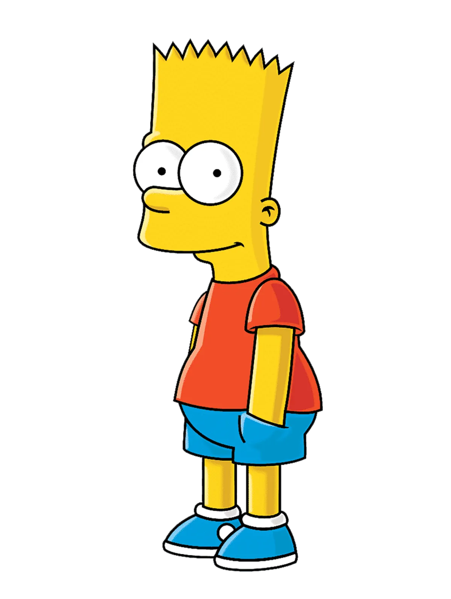

# Week 1: Mengubah Cara Berpikir (Logika vs. Prediksi)
wkjkdjds

## 🧐 Kenalan dulu yuk!
Bayangin kamu lagi ngajarin seorang **adik kecil** cara membedakan antara kucing dan anjing. Kamu tidak mengajarinya rumus matematika yang rumit, kan? Kamu pasti akan menunjukkan banyak foto kucing dan anjing sambil bilang, "Nah, yang ini kucing, yang itu anjing."

Begitu juga dengan AI!

Artificial Intelligence (AI) adalah simulasi kecerdasan manusia yang diproses oleh mesin, terutama sistem komputer. AI tidak "pintar" secara ajaib, dia pintar karena belajar dari data.

## 💡 Analogi Koki Magang 
Bayangkan AI itu seperti seorang **koki magang**.
- `Data` adalah buku resep dan bahan makanan yang kita berikan.
- `Algoritma` adalah cara si koki ngolah bahan itu.
- Lama-kelamaan, tanpa perlu disuruh setiap langkah, si koki ini bisa tahu: *"Oh, kalau bumbunya begini, pasti hasilnya nasi goreng!"*

## 🌍 Contoh Dunia Nyata
Kamu pernah ngga sih ngerasa YouTube atau TikTok kaya bisa baca kita? Itu karena ada AI di belakangnya yang merhatiin video kita yang mana yang kita tonton sampai habis, sama yang mana yang kita skip. Dia belajar dari kebiasaan kita untuk memberikan rekomendasi yang pas.

## 🤣 Fakta Menarik
Kamu tahu, ngga? Istilah *Artificial Intelligence* sudah muncul sejak tahun **1956**! Tapi dulu AI sering dianggap "bodoh" karena komputer zaman dulu lemot. Sekarang, AI jadi "jenius" karena komputer kita sudah sangat cepat dan datanya melimpah ruah (terima kasih, internet!).

## 🕵️ Kuis Si Kurir Cerdas
Saatnya pemanasan, nih! Bayangin kamu sedang membangun sebuah AI untuk aplikasi ojek online. Tugas AI ini adalah menentukan siapa driver yang paling cocok untuk menjemput penumpang bernama Budi.

AI kamu melihat data berikut:
1. Driver A: Jaraknya sangat dekat (2 menit), tapi ratingnya rendah dan motornya sering mogok.
2. Driver B: Jaraknya agak jauh (10 menit), tapi ratingnya bintang 5 dan selalu tepat waktu.
3. Driver C: Jaraknya sedang (5 menit), ratingnya bagus, dan dia sedang mengarah ke lokasi Budi.

**Pertanyaannya:** Menurutmu, sebagai AI yang cerdas, data mana yang paling penting untuk dipertimbangkan supaya **Budi puas**? Dan kalau kamu jadi si AI, Driver mana yang akan kamu pilih?

## 💡 Analogi Detektif Sherlock Holmes
Bayangin AI di industri itu seperti *Sherlock Holmes*. Di sebuah pabrik, AI memperhatikan ribuan mesin.

Dia bisa mendengar "suara mesin yang sedikit serak" (lewat data sensor) dan langsung bilang, *"Hmmm, mesin nomor 7 ini bakal rusak 3 hari lagi!"*

Sebelum mesinnya benar-benar meledak, teknisi sudah memperbaikinya duluan. Ini disebut `Predictive Maintenance`.

## 🌍 Contoh Dunia Nyata (2)
- Di bidang kesehatan, AI bisa memindai ribuan foto *Rontgen* atau *MRI* dalam hitungan detik untuk menemukan tanda-tanda awal kanker yang bisa jadi terlewat oleh mata manusia.
- Di bidang otomotif, mobil Tesla atau Waymo menggunakan AI sebagai *"sopir digital"* yang bisa melihat ke segala arah (360 derajat).

## 🤣 Fakta Menarik (2)
Tahu ngga? Ada AI yang tugasnya khusus untuk mencicipi makanan! Di industri kuliner, AI digunakan untuk menganalisis komposisi kimia makanan agar rasanya selalu konsisten. Jadi, kalau keripik yang kita makan rasanya sama, selalu enak, mungkin ada *"lidah digital"* yang ikut campur di sana! 👅💻

## 🤨 Sahabat atau Saingan?
Yaa sadar ga sadar, AI sudah jadi "teman sekamar" kita. Dari mulai bangun tidur sampai tidur lagi, AI ada di mana-mana. Tapi sebenarnya, AI tuh temen apa bukan sih? Atau malah temen makan temen? Bukan, yee.

AI tuh kaya pisau.
- Bisa dipake buat motong bahan makanan jadi masakan enak (Dampak Positif: bantu kita kerja lebih cepat, ngasih kita rekomendasi film bagus di Netflix, atau bantu Google Maps cari jalan tikus kalo macet).
- Tapi kalo ngga hati-hati, bisa melukai tangan (Dampak Negatif: berita bohong (*hoax*) yang dibuat AI kaya *DeepFake*, atau rasa malas karena semua dikerjakan AI, *ehmm*).


## 🧠 Inti Konsep
🤩 Selamat! kamu udah memahami konsep dasar AI! Sekarang saatnya kita mulai agak serius nih, lebih teknis lah yaa. Sekarang kita masuk ke pembahasan perbedaan AI dan sistem biasa (*if-else)*. AI menyelesaikan ketidakpastian (*ambiguity*) menggunakan **Probabilitas**.

- **Logika Aturan (Rule-Based)** menggunakan struktur `if-else`. Sangat kaku. Jika ada skenario yang belum ditulis kodenya, sistem akan error.

> Tips: Bayangkan seperti resep masakan tradisional yang kaku. Kita memberi tahu komputer "Jika A, maka lakukan B" (struktur if-else). Sistem ini tidak bisa menangani situasi di luar aturan yang tertulis.

- **Logika Prediksi (AI):** Berakar pada **Aljabar Linear**. Mesin melihat pola dari jutaan data dan memberikan jawaban yang "paling mungkin benar".

> Tips: AI bekerja menggunakan "Logika Kreasi" yang berakar pada aljabar linear, kalkulus, dan statistik. Alih-alih mengikuti aturan manusia, AI melihat jutaan contoh data untuk mencari hasil yang paling mungkin benar.

## 🔗 Hubungan Antar Ilmu
- **Ekonomi.** AI membantu pengambilan keputusan investasi di tengah pasar yang tidak menentu.
- **Matematika.** Operasi matriks (perkalian baris dan kolom) adalah "otak" di balik setiap prediksi.

## 📝 PyTorch Cheat-sheet (Basics)
| Fungsi | Kegunaan |
| :--- | :--- |
| `torch.tensor([1, 2])` | Membuat array dasar (tensor) di PyTorch. |
| `tensor.shape` | Melihat dimensi data (ukuran baris/kolom). |
| `torch.matmul(A, B)` | Perkalian matriks (dasar dari semua model AI). |

## 💻 Logika Prediksi Sederhana
```python
import torch

# Representasi fitur (misal: jam belajar & jumlah kopi)
X = torch.tensor([5.0, 2.0]) 

# Bobot (Weight) yang dipelajari AI secara otomatis nanti
W = torch.tensor([0.5, 0.1]) 
bias = 0.5

# Prediksi: (X * W) + bias
y_pred = torch.dot(X, W) + bias
print(f"Hasil Prediksi Kelulusan: {y_pred.item()}")
```

## 🎮 Saatnya bermain!
> “Fun does not come in sizes” – Bart Simpson


> “Kesenangan tidak mengenal ukuran” – Bart Simpson

https://quickdraw.withgoogle.com/
