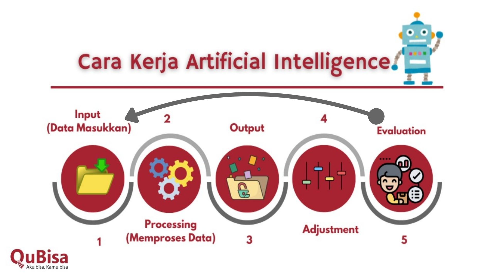
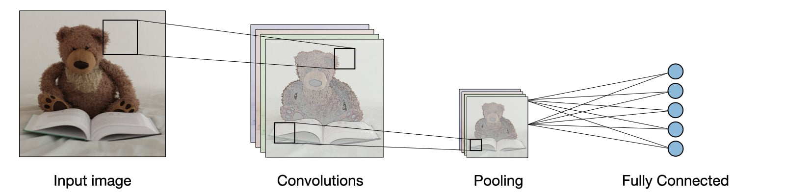
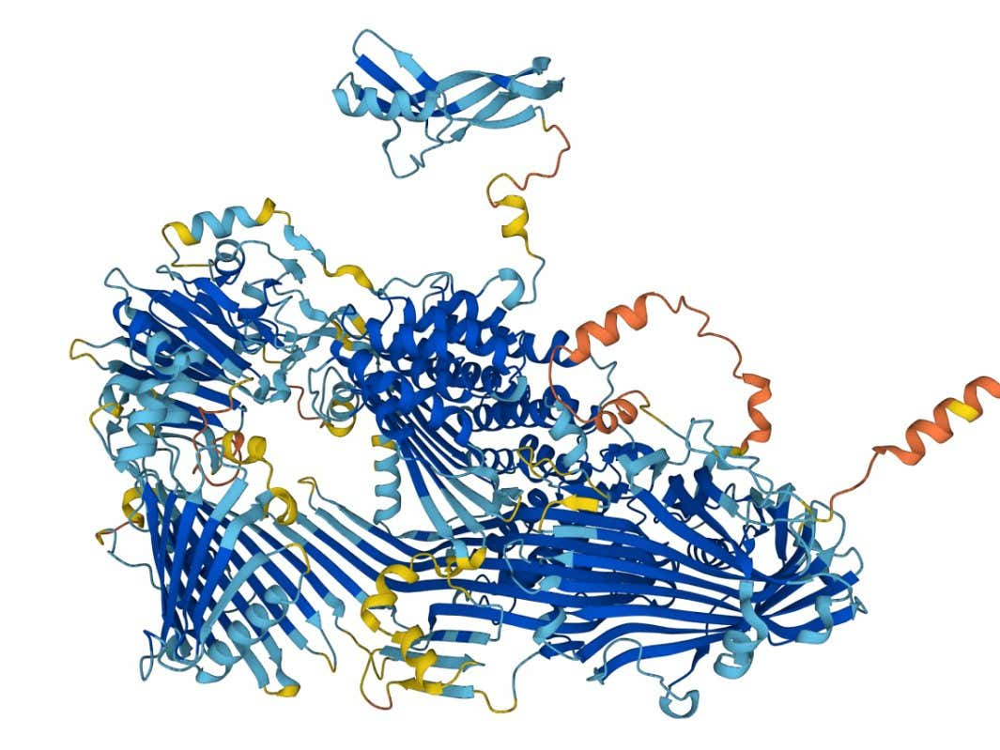
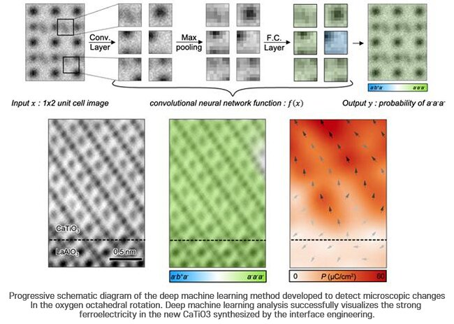
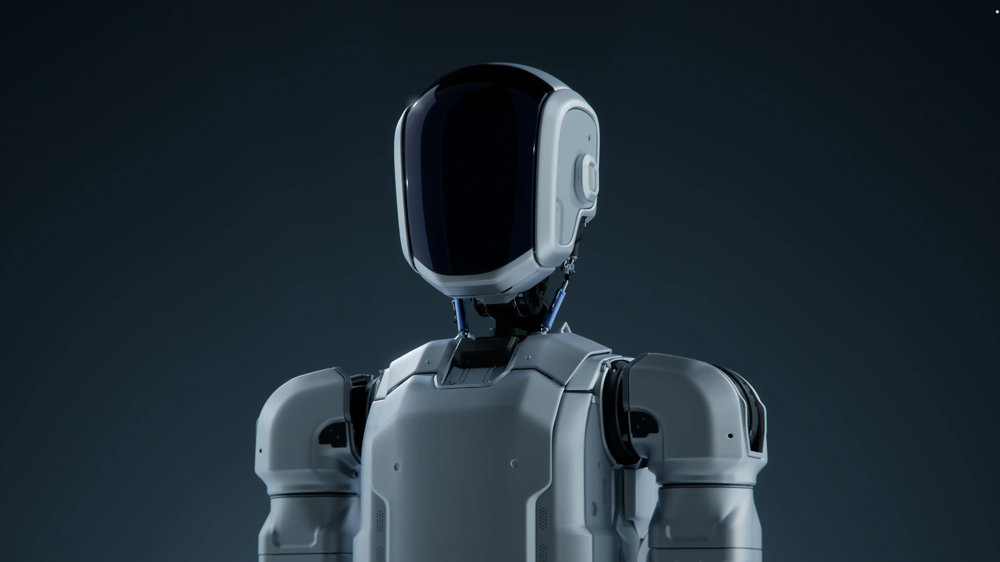
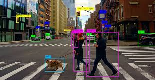

# Week 1: Mengubah Cara Berpikir (Logika vs. Prediksi)


## 🧐 Kenalan dulu yuk!
Bayangin kamu lagi ngajarin seorang **adik kecil** cara membedakan antara kucing dan anjing. Kamu tidak mengajarinya rumus matematika yang rumit, kan? Kamu pasti akan menunjukkan banyak foto kucing dan anjing sambil bilang, "Nah, yang ini kucing, yang itu anjing."

Begitu juga dengan AI!

Artificial Intelligence (AI) adalah simulasi kecerdasan manusia yang diproses oleh mesin, terutama sistem komputer. AI tidak "pintar" secara ajaib, dia pintar karena belajar dari data.

## 💡 Analogi Koki Magang 
Bayangkan AI itu seperti seorang **koki magang**.
- `Data` adalah buku resep dan bahan makanan yang kita berikan.
- `Algoritma` adalah cara si koki ngolah bahan itu.
- Lama-kelamaan, tanpa perlu disuruh setiap langkah, si koki ini bisa tahu: *"Oh, kalau bumbunya begini, pasti hasilnya nasi goreng!"*

## 🌍 Contoh Dunia Nyata
Kamu pernah ngga sih ngerasa YouTube atau TikTok kaya bisa baca kita? Itu karena ada AI di belakangnya yang merhatiin video kita yang mana yang kita tonton sampai habis, sama yang mana yang kita skip. Dia belajar dari kebiasaan kita untuk memberikan rekomendasi yang pas.

## 🤣 Fakta Menarik
Kamu tahu, ngga? Istilah *Artificial Intelligence* sudah muncul sejak tahun **1956**! Tapi dulu AI sering dianggap "bodoh" karena komputer zaman dulu lemot. Sekarang, AI jadi "jenius" karena komputer kita sudah sangat cepat dan datanya melimpah ruah (terima kasih, internet!).

## 🕵️ Kuis Si Kurir Cerdas
Saatnya pemanasan, nih! Bayangin kamu sedang membangun sebuah AI untuk aplikasi ojek online. Tugas AI ini adalah menentukan siapa driver yang paling cocok untuk menjemput penumpang bernama Budi.

AI kamu melihat data berikut:
1. Driver A: Jaraknya sangat dekat (2 menit), tapi ratingnya rendah dan motornya sering mogok.
2. Driver B: Jaraknya agak jauh (10 menit), tapi ratingnya bintang 5 dan selalu tepat waktu.
3. Driver C: Jaraknya sedang (5 menit), ratingnya bagus, dan dia sedang mengarah ke lokasi Budi.

**Pertanyaannya:** Menurutmu, sebagai AI yang cerdas, data mana yang paling penting untuk dipertimbangkan supaya **Budi puas**? Dan kalau kamu jadi si AI, Driver mana yang akan kamu pilih?

## 💡 Analogi Detektif Sherlock Holmes
Bayangin AI di industri itu seperti *Sherlock Holmes*. Di sebuah pabrik, AI memperhatikan ribuan mesin.

Dia bisa mendengar "suara mesin yang sedikit serak" (lewat data sensor) dan langsung bilang, *"Hmmm, mesin nomor 7 ini bakal rusak 3 hari lagi!"*

Sebelum mesinnya benar-benar meledak, teknisi sudah memperbaikinya duluan. Ini disebut `Predictive Maintenance`.

## 🌍 Contoh Dunia Nyata (2)
- Di bidang kesehatan, AI bisa memindai ribuan foto *Rontgen* atau *MRI* dalam hitungan detik untuk menemukan tanda-tanda awal kanker yang bisa jadi terlewat oleh mata manusia.
- Di bidang otomotif, mobil Tesla atau Waymo menggunakan AI sebagai *"sopir digital"* yang bisa melihat ke segala arah (360 derajat).

## 🤣 Fakta Menarik (2)
Tahu ngga? Ada AI yang tugasnya khusus untuk mencicipi makanan! Di industri kuliner, AI digunakan untuk menganalisis komposisi kimia makanan agar rasanya selalu konsisten. Jadi, kalau keripik yang kita makan rasanya sama, selalu enak, mungkin ada *"lidah digital"* yang ikut campur di sana! 👅💻

## 🤨 Sahabat atau Saingan?
Yaa sadar ga sadar, AI sudah jadi "teman sekamar" kita. Dari mulai bangun tidur sampai tidur lagi, AI ada di mana-mana. Tapi sebenarnya, AI tuh temen apa bukan sih? Atau malah temen makan temen? Bukan, yee.

AI tuh kaya pisau.
- Bisa dipake buat motong bahan makanan jadi masakan enak (Dampak Positif: bantu kita kerja lebih cepat, ngasih kita rekomendasi film bagus di Netflix, atau bantu Google Maps cari jalan tikus kalo macet).
- Tapi kalo ngga hati-hati, bisa melukai tangan (Dampak Negatif: berita bohong (*hoax*) yang dibuat AI kaya *DeepFake*, atau rasa malas karena semua dikerjakan AI, *ehmm*).


## 🧠 Inti Konsep
## 2. Pemograman Tradisional vs AI

Coba bayangkan kalian lagi bikin sebuah robot, dimana robotnya. Tugasnya itu simpel, robot harus jalan kalau liat kucing, dan berhenti kalau liat bahlil. Gimana kodingannya?

Pakai if-else? Oke. if pixel_warna == cokelat? Tapi anjing ada yang cokelat, kucing juga ada. if bentuk_telinga == lancip? Tapi ada kucing yang telinganya melipat. Kalian butuh berapa juta if untuk membedakan semua jenis kucing dan anjing di dunia ini? Pasti pusing, kan?

Pemograman yang ribet untuk yang kita sebut sebagai Pemograman Jadul atau Pemograman Tradisional. 


- **Pemrograman Tradisional:** Kita punya $Data + Aturan (Kodingan) = Hasil$. Kamu mendikte komputer apa yang harus dilakukan langkah demi langkah.

```python
# Masukkan data di sini
suara = "meong"
cakar = "bisa ditarik"
hobi = "mengejar laser"
cara_minum = "menjilat halus"
aktivitas = "malam hari"
kepatuhan = "rendah"
ekor = "lentur"
makan = "daging saja"
berburu = "mengintai"
bau = "tidak berbau"

# Logika identifikasi (Hanya output singkat)
if suara == "gukguk": print("ini anjing")
if suara == "meong": print("ini kucing")

if cakar == "selalu keluar": print("ini anjing")
if cakar == "bisa ditarik": print("ini kucing")

if hobi == "mengejar bola": print("ini anjing")
if hobi == "mengejar laser": print("ini kucing")

if cara_minum == "menyendok": print("ini anjing")
if cara_minum == "menjilat halus": print("ini kucing")

if aktivitas == "siang hari": print("ini anjing")
if aktivitas == "malam hari": print("ini kucing")

if kepatuhan == "tinggi": print("ini anjing")
if kepatuhan == "rendah": print("ini kucing")

if ekor == "kaku": print("ini anjing")
if ekor == "lentur": print("ini kucing")

if makan == "apa saja": print("ini anjing")
if makan == "daging saja": print("ini kucing")

if berburu == "mengejar": print("ini anjing")
if berburu == "mengintai": print("ini kucing")

if bau == "kuat": print("ini anjing")
if bau == "tidak berbau": print("ini kucing")

```

Liat kodingannya kan? bahkan itu saja ga cukup sebagai pembeda antara anjing dan kucing. kemampuan kita terbatas untuk mendefenisikan setiap aturan yang ada dan terlalu abstrak. 
- **Artificial Intelligence:** Kita punya $Data + Hasil = Aturan$. Kita memberikan ribuan contoh, dan komputerlah yang bertugas menemukan "pola" atau "fungsi" matematisnya.



Contoh sederhana untuk algoritma CNN


Lihat perbedaannya kan?

dalam AI, kita tidak perlu melakuakn defenisi semua aturan yang ada, kita cukup berikan AI Sebuah output, maka dia akan mendefenisikan semua jenis aturan untuk anjing dan kucing melalui kemampuan nya yaitu pattern recognition. AI akan mencoba mengambil semua aturan tersebut (Polanya) lalu dari pola tersebut, dia akan membuat sebuah aturan yang jauh lebih kompleks dan lebih mendetail dibandingkan memakai if biasa. 


---

## 3. Logika vs Prediksi: Kekakuan `if-else` vs Kelenturan Aljabar

Di sini kita akan membedah mengapa `if-else` tidak cukup untuk membuat robotmu pintar.

### studi kasus untuk prediksi harga ruumah menggunakan if else vs aljabarlinear sederhana**

### Menggunakan IF Else Prediksi Rumah
```python
def prediksi_jadul(luas, lokasi):
    if luas > 0.6:
        if lokasi > 0.5:
            return 1 # Mahal
        else:
            return 0 # Murah
    else:
        return 0 # Murah

print("Hasil If-Else:", prediksi_jadul(0.59, 0.9)) 

```
### Menggunakan Aljabar Linear untuk prediksi rumah
```python
def prediksi_perceptron(luas, lokasi):
    # Bobot (Tingkat Kepentingan)
    w_luas = 0.6
    w_lokasi = 0.8  # Kita anggap lokasi lebih penting daripada luas
    bias = -0.7     # Ambang batas standar harga
    
    # Rumus Aljabar: y = (x1 * w1) + (x2 * w2) + b
    skor = (luas * w_luas) + (lokasi * w_lokasi) + bias
    
    # Activation Function (Keputusan akhir)
    return 1 if skor > 0 else 0

print("Hasil Perceptron:", prediksi_perceptron(0.59, 0.9))

```
> Aljabar Linear merupakan dasar dari Algoritma AI yang terkenal, yaitu Perceptron. 


Perbandingan antara model pemograman biasa dan aljabar linear terletak pada outputnya. dimana outptu dari model tradisional umumnya bersifat kaku, bergantung pada seberapa flexible si pembuat aturannya. 

Sedangkan Alajabar linear yang nilainya berisfat kontinu yang lebih bervariasi dan tidak bergantung dengan sebuah aturan kaku nya. 

> Bias Merupakan sebuah ambang batas (bawah atau atas) yang berfungsi untuk menentukan nilai minimal atau maksimal suatu objek. Misal dalam konteks rumah, biasnay merupakan harga tanahnya (harga ketika tidak ada rumah/bangunan).

Dan juga, di algoritma aljabar linear sederhana, kita bsia memperbarui bobotnya yang biasa kita kenal sebagai tahap belajar. Dengan cara menghitung loss (selisih data sesungguhnya dengan data yang di prediksi). Nantinya hasilnya akan semakin baik seiring dengan di update nya selalu nilai bobotnya yang dapat membautnay mampu melakukan generalisasi terhadap data test atau data baru nantinya.

Sedangkan pemograman tradisional tidak bisa belajar sendiri (harus kiat yang memperbarui aturannya).

### Kesimpulan

- **Sistem Berbasis Aturan (Logika):**
  - Sangat kaku. Misal: `if pixel_warna == 'merah': stop`.
  - Masalah: Cahaya redup sedikit, nilai pixel berubah, robot menabrak. Kamu butuh jutaan baris `if-else` untuk menangani semua kemungkinan di dunia nyata.
- **Sistem Berbasis Prediksi (AI):**
  - Berakar pada Aljabar Linear:

$$y = wx + b$$

  - Di sini, $x$ adalah input (misal: tingkat kecerahan pixel), $w$ adalah Weight (bobot/kepentingan), dan $b$ adalah Bias (kecenderungan).
  - AI tidak memberikan jawaban pasti "Ya" atau "Tidak", melainkan probabilitas. "Saya 98% yakin ini adalah rintangan." Inilah yang membuatnya lentur menghadapi situasi baru.

---

## 4. What AI Can Do?

Kita harus tau beberapa implementasi dari AI ini sendiri sebelum melangkah lebih jauh ke bagian teknisnya, sehingga kalian akan termmotivasi dan tergambar di kepala mau jadi apa kedepannya setelah kalian belajar AI ini sendiri. 


Beberapa contoh penerapan AI ini sendiri di dunai nyata. 

- **AlphaFold**


- **Material Baru**


- **Robotic Agentic**



Topic Roadmap AI yang bisa kalian pilih

1. **Computer Vision**



Penerapannya banyak sekali, contohnya untuk mobil otonomus, dia bekerja untuk mengenali objek di sekiatr agar dapat mengambil keputusan yang tepat apakah berbelok atau berhenti atau maju. 

Lalu di bidang keamanan, CCTV dengan di lengkapi computer vision, denga begitu, tindak kriminal dan pelaku kejahatan lebih muda tertangkap. 

Atau di bidang militer, sebagai alat untuk perlindungan atau serangan negara. 

2. **Natural Language Processing**


3. **Generative AI**


4.**AI for Science**


---

## 4. Implementasi Neuron: Jantung dari Segalanya

Kita akan membangun **Perceptron** (Neuron Buatan paling sederhana). Mahasiswa akan koding langsung di sini.

- **Analogi:** Neuron adalah satu orang juri. Dia menerima beberapa pendapat (Input), memberikan nilai kepentingan pada tiap pendapat (Weight), lalu memberikan satu keputusan akhir.
- **Mekanisme Prediksi (Forward Pass):**
  1. Input ($x$): Sinyal masuk.
  2. Weight ($w$): Seberapa penting input ini?
  3. Summation ($\sum$): Total semua $x \cdot w$.
  4. Activation (Simple Step): Jika total > ambang batas, maka "1" (Aktif), jika tidak "0".

**Latihan Koding Sederhana (Python):**
```python
# Perceptron Sederhana: Menentukan Robot Harus Berhenti atau Jalan
def prediksi_perceptron(luas, lokasi):
    # Bobot (Tingkat Kepentingan)
    w_luas = 0.6
    w_lokasi = 0.8  # Kita anggap lokasi lebih penting daripada luas
    bias = -0.7     # Ambang batas standar harga
    
    # Rumus Aljabar: y = (x1 * w1) + (x2 * w2) + b
    skor = (luas * w_luas) + (lokasi * w_lokasi) + bias
    
    # Activation Function (Keputusan akhir)
    return 1 if skor > 0 else 0

print("Hasil Perceptron:", prediksi_perceptron(0.59, 0.9))
```

Challenge 
```python
# CHALLENGE: Carilah nilai w1, w2, dan bias agar robot HANYA berhenti (1) 
# jika sensor_kiri DAN sensor_kanan bernilai 1.

def otak_robot(s_kiri, s_kanan):
    # TUGAS MAHASISWA: Ubah angka di bawah ini!
    w1 = 0.1  # Coba ganti
    w2 = 0.1  # Coba ganti
    bias = -0.5 # Coba ganti
    
    skor = (s_kiri * w1) + (s_kanan * w2) + bias
    return 1 if skor > 0 else 0

# Uji Coba:
print("Kiri(0) Kanan(0) ->", otak_robot(0, 0)) # Harus 0
print("Kiri(1) Kanan(0) ->", otak_robot(1, 0)) # Harus 0
print("Kiri(0) Kanan(1) ->", otak_robot(0, 1)) # Harus 0
print("Kiri(1) Kanan(1) ->", otak_robot(1, 1)) # Harus 1
```

Tensor playground
https://playground.tensorflow.org/#activation=tanh&batchSize=12&dataset=circle&regDataset=reg-plane&learningRate=0.03&regularizationRate=0&noise=30&networkShape=8,2,2,2,2,2&seed=0.82288&showTestData=false&discretize=false&percTrainData=40&x=true&y=true&xTimesY=true&xSquared=true&ySquared=false&cosX=false&sinX=true&cosY=false&sinY=false&collectStats=false&problem=classification&initZero=false&hideText=false

## 🎮 Saatnya bermain!
> “Fun does not come in sizes” – Bart Simpson


> “Kesenangan tidak mengenal ukuran” – Bart Simpson

https://quickdraw.withgoogle.com/
