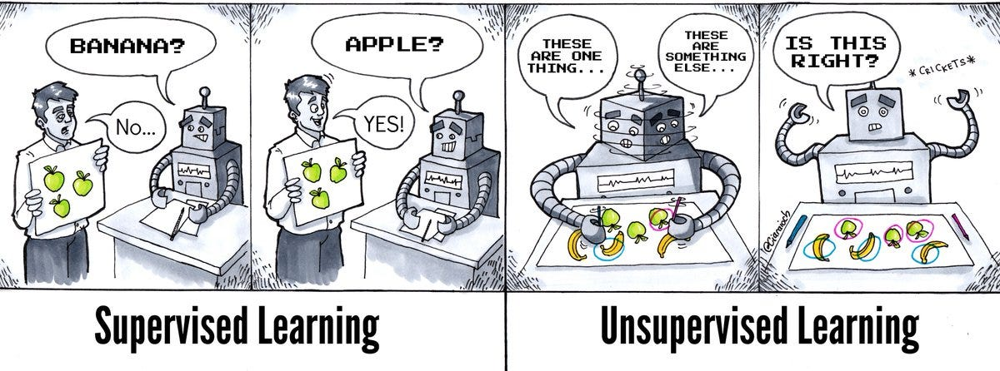
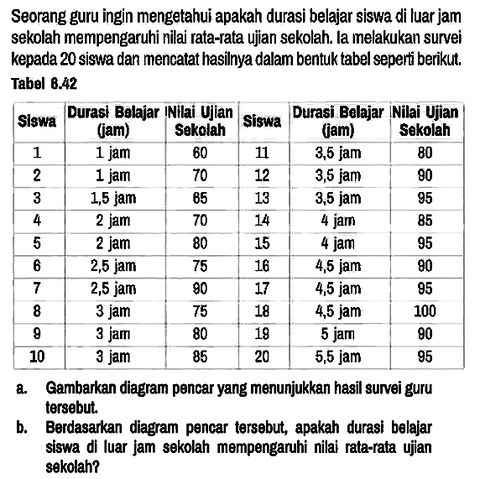
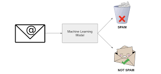
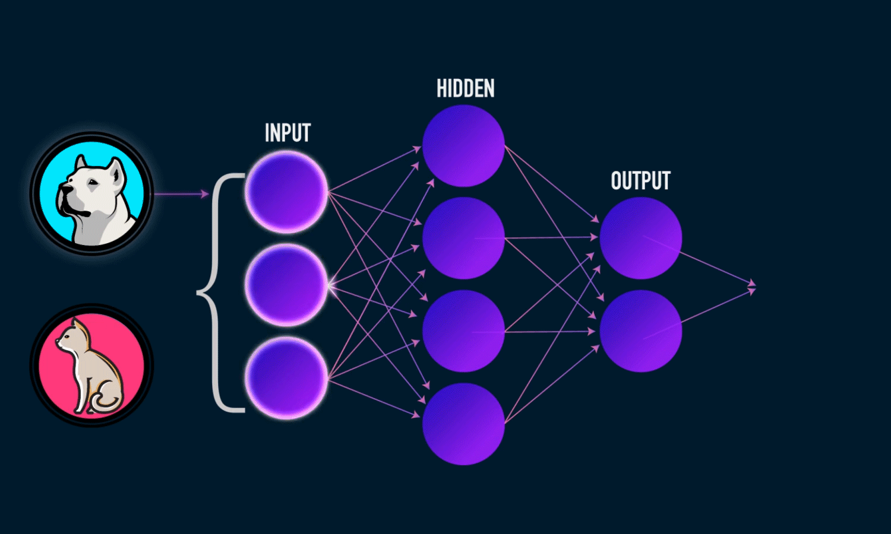
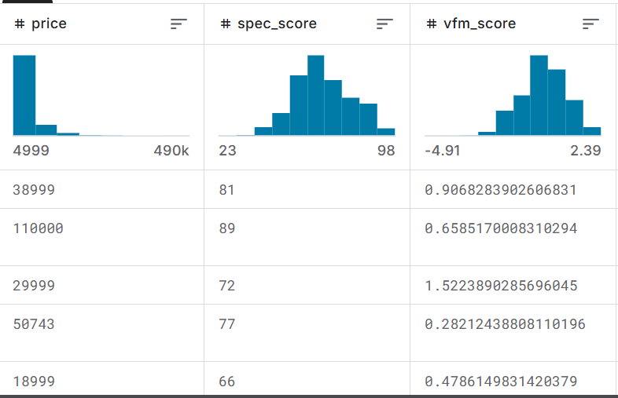
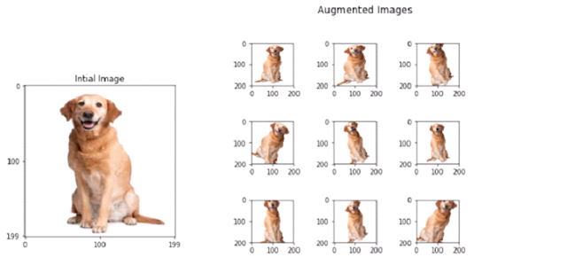
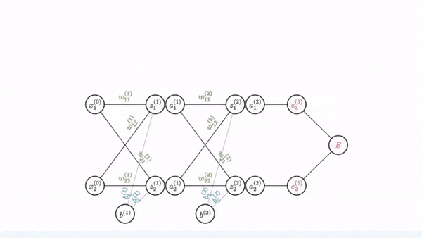
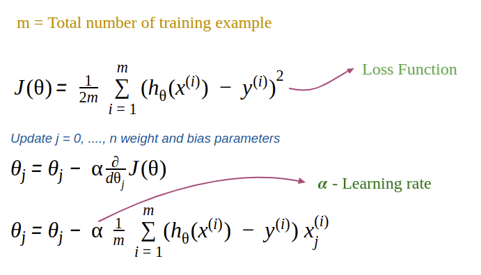
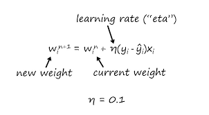
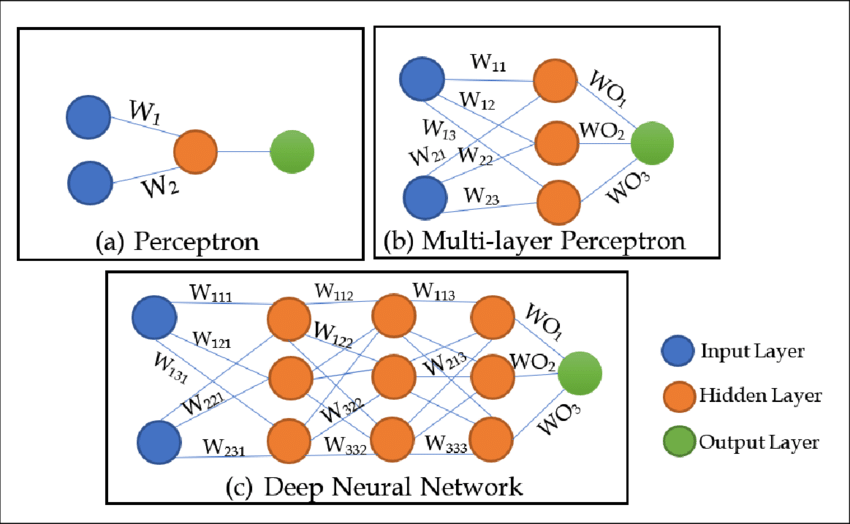

# 🧠 Week 2: Mengenal Jaringan Syaraf Tiruan atau *Artificial Neural Networks* (ANN)

> [!NOTE]
> **Tujuan Pembelajaran:** Memahami perbedaan antara antara beberapa tipe data yang ada, seperti regression, klasifikasi dan clustering. Setelah itu kita akan masuk lebih mendalam soal pembahasan ANN, apa bedanya dengan _perceptron_, serta bagaimana mekansime / cara kerjanya dalam logika matematika dan juga dalam programnya. 

---

Minggu ini kita mempelajari arsitektur dasar AI yang terinspirasi dari struktur neuron di otak manusia. Sebelum kita melangkah lebih jauh, kita harus tahu kalo ada 2 metode utama dalam _machine learning_, yang mana masing-masing memiliki tipe datanya sendiri. Apa aja jenisnya? _Let's dive in_

## 1. 🧠 Metode dalam _Machine Learning_
Di dunia AI, khususnya di bidang _machine learning_, ada 2 metode utama untuk menyelesaikan _problem_ di dunia nyata, yaitu

### 1) _Supervised Learning_
_Supervised Learning_ adalah pembelajaran / proses belajar yang membutuhkan data berlabel, lalu mesin akan belajar dari label itu untuk mendapatkan polanya. 

### 2) _Unsupervised Learning_
_Unsupervised learning_ adalah pembelajaran / proses belajar yang tidak membutuhkan data berlabel, lalu mesin akan belajar dari data tersebut untuk mendapatkan polanya. 



Sederhananya sih gini:
- _Supervised learning_ = belajar pakai mentor (ada petunjuk labelnya / ada refrensi mana yang benar dan salah)
- _Unsupervised learning_ = belajar Mandiri (ga ada petunjuk labelnya)


Dari kedua jenis tipe pembelajarannya, kita bisa memecah _problem_ dalam dunia nyata (_goal_ dari model AI) menjadi 3 hal, yaitu:
1. Regresi (_Regression_)
2. Klasifikasi (_Classification_)
3. Klasterisasi (_Clustering_)

Kita bahas dulu tipe data yang paling umum yaitu regresi dan klasifikasi. 

### 1. Regresi (_Regression_)
Regresi adalah salah satu jenis masalah dalam sebuah machine learning dan juga AI. Regresi biasanya digunakan dalam masalah yang _output_-nya berupa angka / bilangan kontinu. contohnya:

- **Prediksi Harga Rumah**


- **Prediksi Nilai Ujian berdasarkan lamanya belajar**



- **Prediksi Harga bitcoin**


Regresi (_regression_) termasuk kedalam _supervised learning_ (pembelajaran yang terawasi), artinya kita perlu memberikan label terhadap data kita agar mesin mampu mengenali pola dari data tersebut. 

---

### 2. Klasifikasi (_Classification_)
Klasifikasi adalah jenis masalah yang mengharuskan kita untuk mengkategorikan sesuatu atau menebak sesuatu berdasarkan kategori yang sudah ditentukan. Contohnya:

- **Prediksi apakah email ini spam atau bukan**



- **Prediksi apakah gambar ini kucing atau anjing**


Robot termasuk salah satu yang sangat bergantung dengan algoritma klasifikasi, agar mampu mengenali lingkungan sekitarnya.


---

Klasifikasi (_classification_) termasuk kedalam _supervised learning_ (pembelajaran yang terawasi), artinya kita perlu memberikan label terhadap data kita agar mesin mampu mengenali pola dari data tersebut. 

### 3. Klasterisasi / Pengelompokan (_Clustering_)

_Clustering_ adalah jenis masalah yang mengharuskan kita untuk mengelompokkan data secara otomatis tanpa label awal berdasarkan kemiripan karakteristiknya. Contohnya:

- **Segmentasi pelanggan**


- **Pengelompokan berita berdasarkan topik**


---

_Clustering_ termasuk kedalam _unsupervised learning_ (pembelajaran yang tidak terawasi), artinya kita tidak perlu memberikan label terhadap data kita. AI akan mengelompokkan data berdasarkan kemiripan karakteristiknya. 


> **Jadi, kalau kita mau membuat AI, Tentukan dulu jenis masalahnya, tentukan dulu tujuannya, apakah regresi, klasifikasi, atau justru _clustering_. Baru deh dari situ kita tentukan algoritma apa yang cocok untuk masalah tersebut.**

## 2. 🧠 Tipe Data Dalam AI
AI mempunyai tipe datanya sendiri. Tipe data ini adalah sebuah masalah yang berbeda-beda di dunia nyata. Tipe data dan jenis masalah yang berbeda menentukan bagaimana input dan output dari AI tersebut. 

### Untuk INPUT

#### 1. Data Kontinu (contoh: Harga Rumah): 
Inputnya cuma beberapa kolom (Luas, Lokasi). Jadi Input Layer-nya kecil (misal 2 neuron).

#### 2. Data Tak Terstruktur (contoh: Gambar): 
Inputnya adalah pixel. Kalau gambar dari ESP32-CAM kita ukurannya 128 x 128, maka Input Layer-nya harus punya 16.384 neuron!


### Untuk OUTPUT

#### 1. Jika tugasnya Klasifikasi (contoh: Kucing vs Anjing): 
Outputnya harus kategori. Kita butuh fungsi aktivasi seperti Softmax atau Sigmoid agar hasilnya jadi probabilitas (0 sampai 1).

> FYI: Sigmoid dan Softmax adalah fungsi yang mengubah angka riil menjadi nilai probabilitas (0 sampai 1). Bedanya, sigmoid untuk klasifikasi biner (contoh: ya atau tidak). Sedangkan softmax untuk klasifikasi multi-kelas (contoh: menentukan hewan apakah itu).

#### 2. Jika tugasnya Regresi (contoh: Harga Rumah): 
Outputnya angka bebas (bisa ratusan juta). Kita tidak boleh pakai sigmoid di akhir, karena sigmoid akan membatasi angka maksimal jadi 1. Kita butuh fungsi linear.

---

## 3. _Artificial Neural Network_ (ANN)
_Artificial Neural Network_ (ANN) merupakan cabang dari machine learning. ANN ini terinspirasi dari **Biological Neuron** di otak manusia. Bedanya, kalau di otak pakai sinyal listrik, di komputer kita pakai angka (matematika). 

Link Simulasi: https://enki1030.github.io/Simulasi_ANN/

Komponen utama sebuah Neuron Digital:
1.  **Input ($x$)** adalah data mentah yang masuk (misal: nilai pixel, suhu, atau harga).
2.  **Weights ($w$)** atau bobot. Bobot ini yang menentukan seberapa penting sebuah input terhadap hasil akhir.
3.  **Bias ($b$)** atau pengimbang yang memungkinkan model untuk lebih fleksibel dalam mengambil keputusan.
4.  **Activation Function** adalah penentu apakah neuron tersebut harus "aktif" (mengirimkan sinyal) atau tidak.

Oke, sudah mulai masuk dunia per x dan w nya ya wkkwk. Tapi tenang aja. Intinya, satu neuron itu cuma melakukan operasi linear sederhana.

### Linear Combination
Semua input dikali bobot, lalu ditambah bias:
$$z = (x_1 \cdot w_1) + (x_2 \cdot w_2) + ... + (x_n \cdot w_n) + b$$

Atau dalam bentuk ringkas (**Dot Product**):
$$z = \sum_{i=1}^{n} (x_i \cdot w_i) + b$$

### Activation Function
Hasil $z$ tadi dimasukkan ke dalam "filter" non-linear. Dua yang paling sering dipakai:
* **Sigmoid**. Dulu, ini adalah "raja"-nya activation function. Bentuknya melengkung halus menyerupai huruf S. Rumusnya matematikanya: $$\sigma(z) = \frac{1}{1 + e^{-z}}$$.

[gambar sigmoid]

Sigmoid paling sering digunakan di Output Layer untuk kasus _Binary Classification_. Karena hasilnya antara 0-1, kita bisa menganggapnya sebagai probabilitas. Misal: hasil 0.8 berarti "80% kemungkinan ini adalah gambar kucing". Tapi sigmoid ini memiliki kelemahan yaitu ketika nilai $z$ terlalu besar (misal 10) atau terlalu kecil (-10), gradien (turunannya) akan sangat mendekati nol. Pas _Backpropagation_, "sinyal belajar" ini makin lama makin hilang sehingga membuat model berhenti belajar. Tapi sekarang ada `ReLU`

* **ReLU (Rectified Linear Unit)**. Sekarang, ReLU adalah standar _default_ di hampir semua Hidden Layer karena performanya yang gila-gilaan. Rumus matematikanya: $$f(z) = \max(0, z)$$. Sedangkan rentang Outputnya: 0 sampai $\infty$ (Infinity). Tapi kenapa ReLU menjadi standar industri sekarang? Karena ketika kita menggunakan ReLU, komputer ga perlu ngitung rumus rumit, cuma perlu ngecek "Kalau angka ini minus, jadiin nol. Kalau plus, biarin." Sesimpel itu!. Juga sebagai solusi untuk kelemahan sigmoid yaitu dapat membuat gradiennya selalu 1, Selama nilai $z$ positif. Artinya, sinyal belajar bakal terus mengalir kuat sampai ke layer paling awal. Tapi ReLU ini juga punya kelemahan, yaitu ketika sebuah neuron terus-terusan dapet input negatif, dia akan mengeluarkan output 0 secara permanen. Neuron ini jadi "mati" karena ga ada aliran informasi lagi. (Solusinya biasanya pakai variasi lain kayak Leaky ReLU).

---

### Bagaimana Cara kerja ANN?
Cara kerja ANN sebenarnya cukup mudah untuk di pahami. ANN terdiri dari 3 lapisan utama:

#### Input Layer -> Hidden Layer -> Output Layer

3 Layer ini akan melalui 2 proses utama:

- **1. Feed Forward / Forward Pass**
- **2. Backpropagation**


#### 1. _Feed Forward / Forward Pass_



Feed Forward adalah proses perhitungan matematika yang dlakukan ANN untuk memprediksi atau mendapatkan hasil (output) dari inputan. (Data masuk dari input layer $\rightarrow$ diproses hidden layers $\rightarrow$ keluar sebagai prediksi di output layer.)

#### 1. Input Layer
Tugas nya untuk menerima inputan, inputanya bisa berupa angka atau gambar. 

- Data Angka (Prediski Harga HP)



- Data Gambar (Prediksi Anjing)


#### 2. _Hidden Layer_
_Hidden layer_ (lapisan tersembunyi) adalah lapisan neuron buatan yang terletak di antara _input layer_ dan _output layer_ dalam ANN atau _deep learning_. Lapisan ini tidak berinteraksi langsung dengan data mentah dari luar, melainkan memproses informasi yang diteruskan oleh _input layer_.

_Hidden layer_ ini memiliki tugas yang berbeda di setiap fase pemodelan _machine learning_. Kalau di fase _traning_, tugasnya adalah untuk melakukan esktraksi data dan pola agar dengan cara menyesuaikan bobotnya dan biasnya (bagian _backpropagation_). Contoh:
- Hidden Layer 1: Cuma belajar deteksi garis/tepi (_edges_).
- Hidden Layer 2: Mulai belajar bentuk (lingkaran, kotak).
- Hidden Layer 3: Mulai mengenali objek (mata, hidung, roda).

Kalau dalam fase _testing_, tugasnya adalah untuk mencocokkan inputan tersebut apakah sesuai dengan pola yang sudah di _traning_ atau tidak. (bagian _forward pass_)

Lalu kenapa kita harus ada menggunakan _hidden layer_? Sebenarnya ga harus sih. Cuman kalo kita ga pake _hidden layer_, model kita cuma bisa menyelesaikan masalah linear yang sangat simpel.

Jadi, semakin banyak (dalam) _hidden layer_-nya, semakin "pintar" model kita mengenali pola yang susah. Tapi juga jangan asal nambahin _hidden layer_ sampai ratusan / berlebihan. Terlalu banyak _hidden layer_ tapi datanya ga cukup malah buat model kita jadi _Overfitting_ alias jago di data latihan tapi 'dongo' pas ketemu data asli di lapangan. Kuncinya adalah eksperimen.

> **(Pembahasan lebih lanjut _feed forward_ melalui sebuah tes nantinya. Di sini di jelasin mekanisme mulai dari rumus yang digunakan sampai Fungsi aktivasi yang biasanya di gunakan.)
Di sini akan berisi rumus, tempat dilakukannya perhitungan matematika, logika pemrogramannya. 

#### 3. _Output Layer_
_Output layer_ adalah lapisan terakhir yang mengembalikan hasil akhir dari pemrosesan _hidden layer_. Jumlah neuron di sini **wajib** menyesuaikan dengan jenis tugas AI-nya.

Tugasnya _output layer_ adalah mengubah semua hasil "pemikiran" dari _hidden layers_ menjadi format yang kita mengerti (misal: Prediksi angka atau label kategori).

Konfigurasi Neuron:
- Regression (Prediksi Angka). Biasanya cuma 1 neuron. Contoh: Outputnya 250.000 (prediksi harga).
- _Binary Classification_ (2 Kelas). Biasanya 1 neuron dengan aktivasi Sigmoid. Outputnya 0.9 (artinya 90% yakin ini Kucing).
- _Multi-class Classification_ (Banyak Kelas). Jumlah neuron = jumlah kategori. Misal mau tebak angka 0-9, maka ada 10 neuron. Biasanya pakai aktivasi Softmax agar total semua output jadi 1 (100%).

#### 2. Backpropagation



Backpropagation adalah proses penyesuaian bobot dan bias pada ANN agar menghasilkan output yang lebih akurat atau bisa disebut "evaluasi".

Ada dua langkah dalam _backpropagation_, yaitu:

1. **Hitung Error:**


Error dihitung dengan membandingkan output yang dihasilkan ANN dengan output yang seharusnya (label).

2. **Hitung gradient**



Gradient adalah perubahan nilai Error berdasarkan perubahan bobot dan bias. 

3. **Update Bobot dan Bias:**



Bobot dan bias diupdate agar hasil prediksinya semakin bagus. Proses ini di ulangi berkali-kali sampai Error mencapai ambang batas tertentu.

Atau simpelnya gini:
- Model akan menghitung bagian mana dari *weights* ($w$) yang paling bikin "salah".
- Kemudian model  meng-_update_ $w$ dan $b$ sedikit demi sedikit agar di iterasi berikutnya error-nya makin kecil.

---

### 4. Perbedaan ANN dan Perceptron

ANN dan Perceptron adalah dua hal yang berkaitan namun memiliki perbedaan yang cukup signifikan.

Perbedaan ANN dan Perceptron terletak pada jumlah _hidden layer_ yang dimilikinya. ANN memiliki lebih dari satu _hidden layer_, sedangkan Perceptron hanya memiliki satu Hidden Layer.



---

### 5. Implementasi ANN dalam Program

> Praktikum

```python
import numpy as np

# 1. Input (Misal: Luas Tanah, Jumlah Kamar, Usia Rumah)
inputs = np.array([1.0, 2.0, 3.0])

# 2. Weights (Awalnya random, nanti di-update pas training)
weights = np.array([0.2, 0.8, -0.5])

# 3. Bias (Anggap saja konstanta penyeimbang)
bias = 2.0

# 4. Dot Product (Input * Weights + Bias)
z = np.dot(inputs, weights) + bias
print(f"Linear Result (z): {z}")

# 5. Activation Function (ReLU)
def relu(x):
    return max(0, x)

output = relu(z)
print(f"Neuron Output: {output}")
```

_let's play_
1. Buka [Google Teachable Machine](https://teachablemachine.withgoogle.com/).
2. Pilih `Image Project`.
3. Buat 2 Kelas (Contoh: "Pakai Masker" dan "Tidak Pakai Masker").
4. Klik `Train Model`.
5. Lihat gimana model ANN di belakang layar belajar mengenali pola wajah kita  secara _real-time_.
