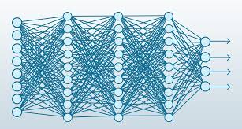
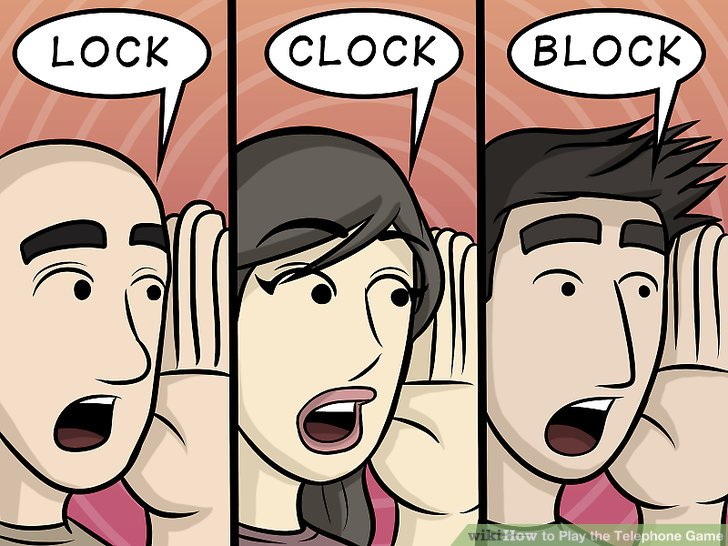
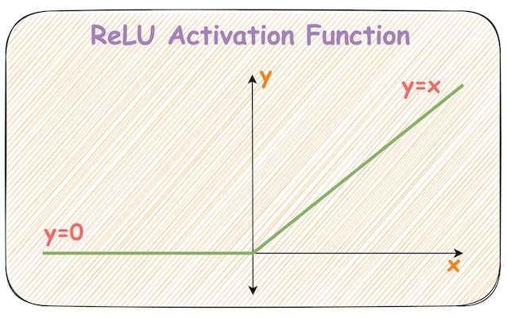
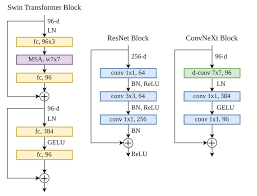

# 🤖 Modul AI: Deep Network & Skip Connection — Fondasi Transformer

> [!NOTE]
> **Tujuan Pembelajaran:** Mempelajari apa itu residual network (ResNet) dan bagaimana cara kerjanya. Serta keunggulan dibandingkan ANN biasa. Kita akan mulai dari implementasi sederhana yang bisa membantu dalam pengolahan data gambar yang sederhana. 


---

## 1. 🧠 Apa itu Resnet?

Residual network atau disingkat ResNet adalah salah satu algoritma dalam deep learning, yang di khususkan untuk mengatasi masalah vanishing gradient pada deep neural network. 

Secara sederhana, ResNet bekerja dengan menambahkan "shortcut connection" atau "skip connection" pada setiap blok layer. Hal ini memungkinkan informasi dari layer sebelumnya untuk "melompat" ke layer berikutnya, sehingga informasi dapat mengalir dengan lebih lancar melalui jaringan.


ini adalah algoritma yang di khususkan untuk mengatasi masalah vanishing gradient pada deep neural network.


### Apa itu Vanishing Gradient?

Vanishing Gradient adalah masalah dalam pelatihan neural network dimana gradient di backpropagation menjadi sangat kecil bahkan mendekati nol  akibat perkalian berulang (chain rule) 



Semakin dalam dan kompleks layer yang di miliki ANN, maka semakin banyak perhitungan berantai di backpropagation, maka ini dapat mempercepat terjadinya vanishing gradient. 

Contoh dalam permainan Telephon game:



Dalam game ini, setiap orang akan memberitahukan kata yang dia dengar dari orang di depannya. pasti semakin banyak pesertanya, maka semakin sulit atau semakin buyar pesan tersebut. 


### Beberapa Solusi yang sudah ada


#### 1. Aktivasi ReLu

Fungsi Rectified Linear Unit (ReLU) memiliki turunan 1 untuk semua nilai input positif, sehingga tidak mengecilkan gradien. 



masalahnya adalah:
- kalau nilainya negatif (0) otomatis hasil perkaliannya itu = 0 yang mengakibtakan tidak adanya nilai gradient yang berpengaruh terhadap tidak adanya perubahan pada bobot (simpelnya AI tidak belajar)
- kalau nilainya positif (z), jika karena ini perkalian exponensial, maka rentan terjadiya exploding gradient (gradient yang semakin membesar akibat perklaian angka positif terus menerus)

---

#### 2. Batch Normalization

**Batch Normalization** menormalkan output setiap layer agar distribusinya tetap stabil (mean ≈ 0, variance ≈ 1) sebelum masuk ke layer berikutnya.

```
x_norm = (x - μ) / √(σ² + ε)
output = γ · x_norm + β
```

Di mana `γ` dan `β` adalah parameter yang dipelajari model.

**Efeknya:**
- Gradient tidak mudah meledak atau menghilang karena distribusi aktivasi selalu terjaga
- Training lebih stabil dan bisa menggunakan learning rate lebih besar

**Kelemahannya:**
- Masih belum cukup untuk jaringan yang sangat dalam (>50 layer)
- Bergantung pada ukuran batch yang memadai

---

#### 3. Weight Initialization yang Lebih Baik

Cara kita menginisialisasi bobot (weights) di awal sangat mempengaruhi apakah gradient akan vanish atau explode.

Dua metode populer:

| Metode | Rumus | Cocok untuk |
|--------|-------|-------------|
| **Xavier / Glorot** | `W ~ Uniform(-√(6/(n_in+n_out)), √(6/(n_in+n_out)))` | Sigmoid, Tanh |
| **He Initialization** | `W ~ Normal(0, √(2/n_in))` | ReLU |

**Intuisi:** Kita ingin variance aktivasi tetap sama di setiap layer — tidak mengecil atau membesar. Inisialisasi yang tepat membantu kondisi ini terpenuhi dari awal training.

**Kelemahannya:**
- Ini hanya solusi di awal — tidak menjamin stabilitas selama training berlangsung pada jaringan yang sangat dalam.

---

#### 4. ✅ Skip Connection (Solusi ResNet)

Ketiga solusi di atas bisa memperlambat vanishing gradient, tapi tidak menghilangkan masalahnya secara fundamental saat jaringan sangat dalam.

ResNet menawarkan pendekatan berbeda: **biarkan gradient punya "jalan pintas" untuk mengalir langsung**.

Ini dilakukan lewat **skip connection** — koneksi yang menjumlahkan output layer sebelumnya langsung ke output beberapa layer kemudian.

```
Output = F(x) + x
```

Di mana:
- `x` = input asli (yang "melompat")
- `F(x)` = transformasi yang dipelajari oleh layer-layer di antaranya
- `F(x) + x` = **Residual Block**

> 💡 **Kenapa ini efektif?** Saat gradient mengalir balik, ia bisa langsung "mempersingkat" jalurnya melalui skip connection. Gradient tidak harus melewati semua layer — sehingga nilainya tidak sempat menghilang.

---

## 2. 📐 Intuisi Matematis — Hitung Manual

Mari kita rasakan sendiri perbedaannya dengan angka.

### Setup Sederhana

Kita punya jaringan 4 layer. Setiap layer melakukan transformasi sederhana:

```
output_layer = W · input_layer
```

Kita asumsikan setiap bobot `W = 0.5` (kecil, tapi ini terjadi di jaringan nyata).

---

### 🔴 Tanpa Skip Connection (ANN Biasa)

Gradient mengalir balik melalui **semua layer** menggunakan chain rule:

```
Gradient total = W₁ × W₂ × W₃ × W₄
               = 0.5 × 0.5 × 0.5 × 0.5
               = 0.5⁴
               = 0.0625
```

Bayangkan jaringan dengan **20 layer**:

```
Gradient = 0.5²⁰ = 0.00000095...  ≈ 0
```

Gradient layer pertama sudah hampir nol. **Layer awal tidak belajar apapun.**

---

### 🟢 Dengan Skip Connection (ResNet)

Sekarang kita tambahkan skip connection. Pada setiap blok (misal tiap 2 layer), output-nya menjadi:

```
Output_blok = F(x) + x
```

Saat backpropagation, gradient dari skip connection adalah:

```
∂Output/∂x = ∂F(x)/∂x + 1
```

Perhatikan angka **+1** itu. Gradient **minimal bernilai 1** dari jalur skip connection, tidak peduli seberapa kecil `∂F(x)/∂x`.

**Simulasi dengan 4 blok (8 layer efektif):**

```
Gradient_blok  = 0.5² + 1 = 1.25  (per blok)

Gradient_total = 1.25 × 1.25 × 1.25 × 1.25
               = 1.25⁴
               = ≈ 2.44
```

Gradient malah **tumbuh** — dan tidak menghilang ke layer-layer awal.

---

### 📊 Perbandingan Langsung

| Kondisi | Rumus | Hasil (4 blok / 8 layer) |
|--------|-------|--------------------------|
| Tanpa skip (W=0.5) | `0.5^8` | **0.0039** — hampir nol |
| Dengan skip | `(0.5² + 1)^4` | **2.44** — gradient mengalir |

> 💡 **Takeaway:** Skip connection bukan hanya "trik arsitektur" — secara matematis, ia memastikan gradient selalu punya nilai minimal yang berarti untuk mengalir kembali ke layer awal.

---

### 🖊️ Latihan Hitung Manual

bandingkan untuk perhitungan neuron dan gradient antara resnet dan ann biasa dengan jumlah neuron yang sama

*(Diskusikan jawaban bersama setelah mencoba sendiri!)*

---

## 3. 🏗️ Arsitektur ResNet — Dari Blok ke Jaringan

### Struktur Residual Block

Satu blok ResNet standar terdiri dari:


### Varian ResNet Berdasarkan Kedalaman

| Arsitektur | Jumlah Layer | Parameter | Cocok untuk |
|------------|-------------|-----------|-------------|
| ResNet-18 | 18 | ~11 juta | Dataset kecil, learning cepat |
| ResNet-34 | 34 | ~21 juta | Dataset menengah |
| ResNet-50 | 50 | ~25 juta | Benchmark umum |
| ResNet-101 | 101 | ~44 juta | Akurasi tinggi |
| ResNet-152 | 152 | ~60 juta | State-of-the-art (2015) |

> 💡 **Catatan untuk kita:** Konsep residual block ini **bukan hanya untuk image**. Transformer (yang akan kita pelajari di Week 6) menggunakan skip connection yang identik di setiap sub-layer-nya. Jadi memahami ResNet adalah fondasi untuk memahami LLM.

---

### Koneksi ke Transformer (Preview Week 6)

Perhatikan arsitektur satu encoder block Transformer:

```
Input (x)
    │
    ├──────────────────┐  ← Skip Connection (persis seperti ResNet!)
    │                  │
  Self-Attention       │
    │                  │
    └────────( + )─────┘
              │
         Layer Norm
              │
    ├──────────────────┐  ← Skip Connection lagi!
    │                  │
  Feed Forward         │
    │                  │
    └────────( + )─────┘
              │
         Layer Norm
              │
           Output
```

**ResNet dan Transformer menggunakan prinsip yang sama.** Belajar ResNet sekarang = fondasi untuk memahami GPT, BERT, dan Claude nanti.

---

## 4. ⚙️ Implementasi — Kode Python

### Setup Environment

```python
# Install dependencies

import tensorflow as tf
from tensorflow.keras import layers, models

import matplotlib.pyplot as plt
import numpy as np
```

---

### Bagian A: Implementasi Sederhana Vanishhing Gradient

Sebelum ke ResNet, mari kita **buktikan** masalahnya dengan kode:


```python
import tensorflow as tf
from tensorflow.keras import layers, models

# 1. ANN Biasa 

class DeepANN_TF(models.Model):
    def __init__(self, num_layers=20):
        super(DeepANN_TF, self).__init__()
        self.network = models.Sequential()
        self.network.add(layers.Input(shape=(64,)))
        for _ in range(num_layers - 1):
            self.network.add(layers.Dense(64, activation='sigmoid'))
        self.network.add(layers.Dense(10))

    def call(self, x):
        return self.network(x)

# 2. Lihat gradientnya
model_tf = DeepANN_TF(num_layers=20)
x_tf = tf.random.normal((32, 64))
y_tf = tf.random.uniform((32,), minval=0, maxval=10, dtype=tf.int32)

with tf.GradientTape() as tape:
    output_tf = model_tf(x_tf)
    loss_tf = tf.keras.losses.SparseCategoricalCrossentropy(from_logits=True)(y_tf, output_tf)

grads = tape.gradient(loss_tf, model_tf.trainable_variables)

print("\n=== Gradient per Layer (TensorFlow ANN, 20 layer) ===")
for var, grad in zip(model_tf.trainable_variables, grads):
    if grad is not None:
        print(f"{var.name:40s} | grad norm: {tf.norm(grad).numpy():.8f}")
```

**Output yang akan kamu lihat:**
```
network.0.weight   | grad norm: 0.12345678
network.2.weight   | grad norm: 0.05678901
...
network.36.weight  | grad norm: 0.00000003   ← hampir nol!
network.38.weight  | grad norm: 0.00000001   ← mati
```

Layer-layer awal mendapatkan gradient yang sangat kecil — mereka **tidak belajar**.

---

### Bagian B: Implementasi ResNet Block


```python
# Residual Block 

class ResidualBlock_TF(layers.Layer):
    def __init__(self, units):
        super(ResidualBlock_TF, self).__init__()
        self.dense1 = layers.Dense(units)
        self.bn1 = layers.BatchNormalization()
        self.relu = layers.Activation('relu')
        self.dense2 = layers.Dense(units)
        self.bn2 = layers.BatchNormalization()

    def call(self, x, training=False):
        identity = x
        out = self.dense1(x)
        out = self.bn1(out, training=training)
        out = self.relu(out)
        out = self.dense2(out)
        out = self.bn2(out, training=training)
        out = layers.Add()([out, identity])
        out = self.relu(out)
        return out

class SimpleResNet_TF(models.Model):
    def __init__(self, num_blocks=10, num_classes=10):
        super(SimpleResNet_TF, self).__init__()
        self.input_layer = layers.Dense(64)
        self.res_blocks = models.Sequential([
            ResidualBlock_TF(64) for _ in range(num_blocks)
        ])
        self.output_layer = layers.Dense(num_classes)

    def call(self, x, training=False):
        x = self.input_layer(x)
        x = self.res_blocks(x, training=training)
        x = self.output_layer(x)
        return x

# Cek gradient ResNet TF
resnet_tf = SimpleResNet_TF(num_blocks=10)
x_tf = tf.random.normal((32, 64))
y_tf = tf.random.uniform((32,), minval=0, maxval=10, dtype=tf.int32)

with tf.GradientTape() as tape:
    out_tf = resnet_tf(x_tf)
    loss_tf = tf.keras.losses.SparseCategoricalCrossentropy(from_logits=True)(y_tf, out_tf)

grads_resnet = tape.gradient(loss_tf, resnet_tf.trainable_variables)
print("\n=== Gradient per Layer (TensorFlow ResNet, 10 blocks) ===")
for var, grad in zip(resnet_tf.trainable_variables, grads_resnet):
    if grad is not None:
        print(f"{var.name:50s} | grad norm: {tf.norm(grad).numpy():.8f}")
```

**Yang akan kamu lihat:** Gradient di semua layer — termasuk yang paling awal — tetap memiliki nilai yang berarti.

---

### Bagian C: Studi Kasus — ANN vs ResNet pada Dataset Nyata

Kita akan membandingkan performa keduanya pada dataset **CIFAR-10** (10 kategori gambar).


```python
import tensorflow as tf
from tensorflow.keras import layers, models

# 1. Persiapkan Dataset CIFAR-10
(x_train, y_train), (x_test, y_test) = tf.keras.datasets.fashion_mnist.load_data()
x_train, x_test = x_train / 255.0, x_test / 255.0

# 2. Model: ANN Biasa
def build_ann_tf():
    model = models.Sequential([layers.Flatten(input_shape=(28, 28))])
    for _ in range(11):
        model.add(layers.Dense(512, activation='relu'))
    model.add(layers.Dense(10))
    return model

# 3. Model: ResNet Sederhana
class ResBlockImage_TF(layers.Layer):
    def __init__(self, size=512):
        super(ResBlockImage_TF, self).__init__()
        self.dense1 = layers.Dense(size)
        self.bn1 = layers.BatchNormalization()
        self.relu = layers.Activation('relu')
        self.dense2 = layers.Dense(size)
        self.bn2 = layers.BatchNormalization()

    def call(self, x, training=False):
        identity = x
        out = self.dense1(x)
        out = self.bn1(out, training=training)
        out = self.relu(out)
        out = self.dense2(out)
        out = self.bn2(out, training=training)
        return self.relu(out + identity)

class ResNetImage_TF(models.Model):
    def __init__(self, num_blocks=10):
        super(ResNetImage_TF, self).__init__()
        self.flatten = layers.Flatten()
        self.input_fc = layers.Dense(512)
        self.res_blocks = models.Sequential([ResBlockImage_TF(512) for _ in range(num_blocks)])
        self.output_fc = layers.Dense(10)

    def call(self, x, training=False):
        x = self.flatten(x)
        x = self.input_fc(x)
        x = self.res_blocks(x, training=training)
        return self.output_fc(x)

# 4. Training
print("Training TensorFlow Models...")
ann_tf = build_ann_tf()
ann_tf.compile(optimizer='adam', loss=tf.keras.losses.SparseCategoricalCrossentropy(from_logits=True), metrics=['accuracy'])
ann_tf.fit(x_train, y_train, epochs=5, batch_size=64, verbose=1)

resnet_tf = ResNetImage_TF(num_blocks=10)
resnet_tf.compile(optimizer='adam', loss=tf.keras.losses.SparseCategoricalCrossentropy(from_logits=True), metrics=['accuracy'])
resnet_tf.fit(x_train, y_train, epochs=5, batch_size=64, verbose=1)
```

---

## 5. 🔬 Analisis & Diskusi

### Kenapa ResNet Menang?

Dari eksperimen di atas, kamu seharusnya melihat:

| Aspek | ANN Biasa | ResNet |
|-------|-----------|--------|
| **Training loss** | Turun lambat / stagnan | Turun lebih konsisten |
| **Test accuracy** | Lebih rendah | Lebih tinggi |
| **Gradient di layer awal** | Hampir nol | Tetap bermakna |
| **Kemampuan belajar** | Layer awal "mati" | Semua layer belajar aktif |

### Tiga Insight Utama

**1. Skip connection bukan hanya "jalan pintas"**
Ia adalah mekanisme yang memastikan gradient selalu punya jalur langsung untuk mengalir kembali. Secara matematis, turunan dari `F(x) + x` terhadap `x` selalu mengandung `+1`, sehingga gradient tidak pernah benar-benar nol.

**2. Model belajar "residual", bukan fungsi penuh**
Nama "Residual" bukan kebetulan. Layer-layer di dalam blok tidak belajar transformasi penuh `H(x)` — mereka hanya belajar **selisih** (`residual`) antara output yang diinginkan dan input yang sudah ada: `F(x) = H(x) - x`. Ini jauh lebih mudah dioptimalkan.

**3. Relevansi ke LLM**
Setiap encoder dan decoder block dalam Transformer menggunakan skip connection yang identik. Tanpa mekanisme ini, model bahasa besar seperti GPT atau BERT tidak mungkin dilatih secara stabil. **Yang kita pelajari hari ini adalah fondasi dari teknologi yang ada di balik ChatGPT dan Claude.**

---

### ❓ Pertanyaan Diskusi

1. Jika kita punya jaringan yang sangat dangkal (2–3 layer), apakah ResNet masih dibutuhkan? Mengapa?
2. Apa yang akan terjadi jika dimensi input dan output dari sebuah residual block berbeda? Bagaimana cara mengatasinya?
3. Kenapa kita menggunakan `F(x) + x` dan bukan `F(x) × x`? Apa perbedaan matematisnya?

---

## 📚 Referensi

- He, K., et al. (2015). *Deep Residual Learning for Image Recognition*. [ArXiv:1512.03385](https://arxiv.org/abs/1512.03385)
- Vaswani, A., et al. (2017). *Attention Is All You Need*. [ArXiv:1706.03762](https://arxiv.org/abs/1706.03762)
- PyTorch Documentation: [pytorch.org/docs](https://pytorch.org/docs/stable/index.html)

---

> [!TIP]
> **Next Week (Week 4):** Kita akan masuk ke Unsupervised Learning — bagaimana model bisa belajar dari data tanpa label. Ini juga salah satu fondasi dari cara LLM modern dilatih (pre-training tanpa label eksplisit).