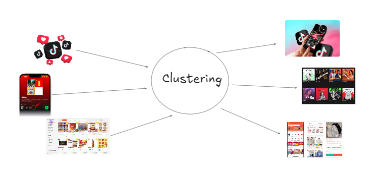
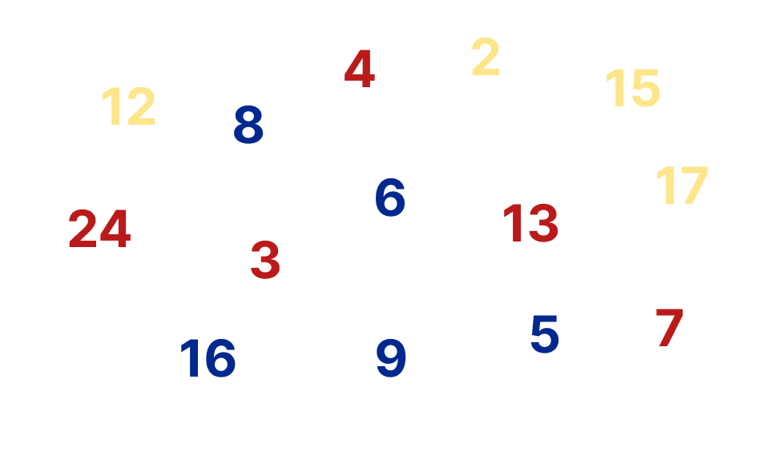

# 🌌 Minggu 4: Unsupervised Learning — Seni Menemukan Pola dalam Kekacauan

> **Tujuan Pembelajaran:** 
> Memahami kekuatan AI untuk mengorganisir data tanpa bantuan label atau "kunci jawaban". Kita akan mengeksplorasi bagaimana mesin bisa "berpikir" seperti seorang arkeolog untuk menemukan struktur tersembunyi di dunia nyata.

---

## 1. 🎭 Sang Guru vs Sang Arkeolog (Konsep Dasar)

Sebelumnya, kita belajar **Supervised Learning** (pembelajaran terawasi). Bayangkan itu seperti belajar dengan Guru: Ada soal, ada kunci jawaban. AI hanya bertugas mencocokkan pola agar hasilnya sama dengan kunci jawaban.

Namun, bagaimana jika **tidak ada kunci jawaban**? Inilah **Unsupervised Learning**.

- **Supervised Learning (Sang Murid):** "Guru bilang ini foto kucing, maka saya cari ciri-ciri kucing berdasarkan contoh yang sudah dilabeli 'kucing'."
- **Unsupervised Learning (Sang Arkeolog):** "Saya punya seribu artefak kuno. Saya tidak tahu namanya, tapi yang ini bentuknya kotak, yang itu bulat. Saya akan kelompokkan mereka berdasarkan kemiripannya."

**Pesan Utama:** Unsupervised learning bukan tentang menebak benar/salah, tapi tentang **mengenali struktur, pola, dan anomali** dalam lautan data.

---

## 2. 🎵 Keajaiban di Balik Layar: Spotify & TikTok


Kalina pernah ga si kepikiran gimana TikTok tahu video apa yang kalian suka, padahal kalian tidak pernah mengisi survei? 

TikTok dan Spotify merekam setiap detik perilaku kalian (apa yang di-skip, apa yang ditonton ulang, genre apa yang sering didengar). Data mentah ini masuk ke algoritma **Clustering**.



AI tidak secara ajaib tahu kalian "Suka K-Pop". AI hanya memproses angka dan berkata: 
*"User Niko punya pola interaksi yang sangat mirip dengan Cluster #402 (yang secara kebetulan adalah kelompok pengguna yang sering mendengarkan lagu K-Pop)."*

Boom! Rekomendasi kalian pun muncul dengan sangat presisi.

---

## 3. 🎮 Interactive Game: "The Ghost Pattern"


Bayangkan kita diberikan sekumpulan objek acak (misalnya: apel merah, bola kasti hijau, mobil mainan merah, daun hijau). Tugas kita adalah membaginya menjadi beberapa kelompok.

- Siapa yang mengelompokkan berdasarkan **Warna**? (Merah vs Hijau)
- Siapa yang mengelompokkan berdasarkan **Bentuk**? (Bulat vs Tidak Bulat)
- Siapa yang mengelompokkan berdasarkan **Fungsi/Kategori**? (Benda alam vs Buatan manusia)

**Pelajaran:** 
Dalam Unsupervised Learning, **semua pengelompokan kita benar**. Hasil akhir sangat bergantung pada karakteristik (fitur) apa yang menurut mesin paling menonjol atau yang kita minta mesin perhatikan. Itulah yang disebut **Feature Selection**.

---

## 4. 👑 Preprocessing Is King 
> **"In the industry, data doesn't come with labels; it comes with noise, bias, and dirt. This is your survival guide to finding signals in the noise."**

Sebelum menyentuh algoritma *clustering*, ada satu teknik yang wajib kita pelajari, yaitu **Feature Scaling.**

K-Means dan algoritma berbasis jarak lainnya sangat sensitif terhadap satuan. Jika fitur `Gaji` (skala jutaan) dicampur dengan `Usia` (skala puluhan), maka `Usia` akan dianggap sebagai *noise* karena variansi jaraknya yang **kecil**.

**Standardization (Z-Score):**
Kita mentransformasi data agar memiliki rata-rata ($\mu$) = 0 dan standar deviasi ($\sigma$) = 1.
$$z = \frac{x - \mu}{\sigma}$$

Tanpa teknik ini, model *clustering* kita akan "buta" terhadap fitur dengan skala kecil tapi memiliki informasi penting.

---

## 5. ⚙️ Simulasi Algoritma, Dari Kaku ke Bijak

Di dunia *Machine Learning*, sebenarnya ada banyak sekali "jalan" atau pendekatan algoritma untuk melakukan *clustering*. Secara garis besar, terlepas dari metodenya, tujuan utamanya selalu sama: **mengukur jarak atau kedekatan** antar data untuk memisahkan mereka menjadi "pulau-pulau" atau kelompok yang punya karakteristik serupa.

Ada algoritma yang bekerja dengan mengukur jarak fisik antar titik data, ada yang mengelompokkan data berdasarkan seberapa padat mereka menumpuk di satu area (*density-based*), dan ada pula yang membangun silsilah hierarki pengelompokan dari yang terkecil hingga terbesar.

Namun dari sekian banyak metode tersebut, **K-Means** selalu menjadi "pintu gerbang utama" yang wajib dipelajari dan merupakan metode *clustering* yang **paling sering dipakai di industri**. Kenapa?

1. **Sangat Cepat & Skalabel:** K-Means mengandalkan perhitungan jarak sederhana. Ia bisa memproses jutaan baris data jauh lebih cepat dibandingkan metode lain yang membutuhkan peta komputasi kompleks.
2. **Sederhana & Intuitif:** Konsepnya sangat logis. Ia hanya mencari titik pusat (*centroid*) dari sebuah kerumunan dan menarik data terdekat ke arahnya. Ini membuatnya sangat mudah dijelaskan kepada tim bisnis atau klien.
3. **Sangat Praktis untuk Kebutuhan Bisnis:** Dalam dunia nyata (misalnya: segmentasi pelanggan, menentukan zonasi logistik, atau membagi paket layanan berlangganan), perusahaan biasanya **sudah tahu atau memiliki target** berapa kelompok yang mereka inginkan. Karena di K-Means kita yang menentukan jumlah klaster ("K") sejak awal, algoritma ini menjadi solusi yang *to the point*.

Mari kita berkenalan langsung dengan sang primadona *clustering* ini!

### A. K-Means: "Permainan Mencari Teman"

K-Means adalah algoritma *clustering* paling populer karena kesederhanaannya dan kecepatannya.

**Cara Kerjanya:**
1. **Inisialisasi:** Tentukan $K$ (misal 3) titik acak sebagai "Pusat Kelompok" (Centroid).
2. **Assignment:** Setiap data "berlari" ke Centroid yang jaraknya paling dekat.
3. **Update:** Centroid pindah ke tengah-tengah (rata-rata) dari kerumunan barunya.
4. **Repeat:** Ulangi langkah 2 dan 3 sampai tidak ada lagi data yang berpindah tempat (konvergen).

**💻 Implementasi K-Means dengan Python**

```python
import numpy as np
import matplotlib.pyplot as plt
from sklearn.datasets import make_blobs

# 1. Membuat data buatan (3 kelompok)
X, y = make_blobs(n_samples=300, centers=3, cluster_std=0.60, random_state=0)

def euclidean_distance(x1, x2):
    return np.sqrt(np.sum((x1 - x2) ** 2))

class KMeansManual:
    def __init__(self, k=3, max_iters=100):
        self.k = k
        self.max_iters = max_iters

    def fit_predict(self, X):
        n_samples, n_features = X.shape
        
        # 1. Inisialisasi: Pilih k titik acak sebagai centroid awal
        random_idxs = np.random.choice(n_samples, self.k, replace=False)
        self.centroids = X[random_idxs]

        for _ in range(self.max_iters):
            # 2. Assignment: Hitung jarak & kelompokkan ke centroid terdekat
            self.clusters = [[] for _ in range(self.k)]
            for idx, x in enumerate(X):
                distances = [euclidean_distance(x, centroid) for centroid in self.centroids]
                closest_k = np.argmin(distances)
                self.clusters[closest_k].append(idx)

            centroids_old = self.centroids.copy()

            # 3. Update: Hitung rata-rata tiap kelompok untuk centroid baru
            for cluster_idx, cluster in enumerate(self.clusters):
                if len(cluster) > 0:
                    self.centroids[cluster_idx] = np.mean(X[cluster], axis=0)

            # 4. Cek Konvergensi: Berhenti jika centroid tidak bergeser lagi
            if np.sum(np.abs(self.centroids - centroids_old)) == 0:
                break
                
        # Format output prediksi
        y_pred = np.zeros(n_samples)
        for cluster_idx, cluster in enumerate(self.clusters):
            for sample_idx in cluster:
                y_pred[sample_idx] = cluster_idx
        return y_pred

kmeans_manual = KMeansManual(k=3)
y_manual = kmeans_manual.fit_predict(X)


from sklearn.cluster import KMeans

# Inisialisasi dan melatih K-Means bawaan sklearn
kmeans_sklearn = KMeans(n_clusters=3, random_state=42, n_init=10)
y_sklearn = kmeans_sklearn.fit_predict(X)
centers_sklearn = kmeans_sklearn.cluster_centers_


# PERBANDINGAN
fig, (ax1, ax2) = plt.subplots(1, 2, figsize=(12, 5))

# Plot K-Means Manual
ax1.scatter(X[:, 0], X[:, 1], c=y_manual, s=50, cmap='viridis')
ax1.scatter(kmeans_manual.centroids[:, 0], kmeans_manual.centroids[:, 1], c='red', s=200, alpha=0.75, marker='X')
ax1.set_title('K-Means Manual')

# Plot K-Means Scikit-Learn
ax2.scatter(X[:, 0], X[:, 1], c=y_sklearn, s=50, cmap='viridis')
ax2.scatter(centers_sklearn[:, 0], centers_sklearn[:, 1], c='red', s=200, alpha=0.75, marker='X')
ax2.set_title('K-Means Scikit-Learn')

plt.tight_layout()
plt.show()
```

Dengan kata lain:
*   **Dalam logika visual,** ia menaruh titik tengah (*Centroid*) secara acak, lalu memaksa setiap data untuk "setia" pada satu kelompok terdekat.
*   **Dalam matematika,** ia meminimalkan **inertia** atau *Within-Cluster Sum of Squares* (WCSS):
$$J = \sum_{i=1}^{k} \sum_{x \in C_i} ||x - \mu_i||^2$$

Dimana:
- $k$ = Jumlah klaster.
- $C_i$ = Klaster ke-$i$.
- $x$ = Titik data dalam klaster.
- $\mu _i$: Centroid (titik pusat) dari klaster $C_i$.
- $||x - \mu_i||^2$: Kuadrat jarak Euclidean antara titik data dan centroid.


> Inersia menghitung total kuadrat jarak antara setiap titik data dan centroid (pusat) klaster yang ditugaskan kepadanya.

> Nilai inersia **rendah** berarti klaster yang padat dan terdefinisi dengan baik (titik data sangat dekat dengan pusat klastenya).

> Nilai inersia **tinggi** berarti klaster yang tersebar luas (kurang optimal).
*   **Masalahnya,** dalam dunia industri, K-Means gagal jika data kita tumpang tindih (*overlapping*) atau berbentuk lonjong. Ia terlalu kaku karena memberikan keputusan **0 atau 1** (*Hard Assignment*).

### B. EM (Expectation-Maximization) dengan Gaussian Mixture: "Si Bijak yang Luwes"

Jika K-Means itu kaku ("Kamu harus 100% masuk Kelompok A"), algoritma berbasis probabilitas seperti **Gaussian Mixture Models (GMM) dengan EM** itu lebih luwes ("Kamu 70% cocok dengan Kelompok A, tapi ada 30% sifat Kelompok B") untuk data industri yang berantakan yang mana kita butuh nuansa "mungkin". Algoritma EM (digunakan pada **Gaussian Mixture Models**) memberikan nilai probabilitas (0.0 sampai 1.0).

**Masalah MLE (Maximum Likelihood).** MLE konvensional sering gagal pada data tak berlabel karena dia butuh "kepastian" untuk menghitung parameter.

Secara statistik, kita ingin mencari parameter $\theta$ (mean $\mu$ dan varians $\sigma$) yang memberikan **Likelihood** tertinggi terhadap data kita:
$$L(\theta) = P(X | \theta)$$

**Alur Kerja EM:**
1.  **E-Step (Expectation):** 
    *   *Logic:* "Berdasarkan posisi model sekarang, seberapa besar **probabilitas** titik ini milik klaster A dibanding B?"
    *   *Result:* Menghasilkan nilai **Responsibility** (bobot kepercayaan).
    > Tebak dulu, siapa milik siapa berdasarkan probabilitas.
2.  **M-Step (Maximization):**
    *   *Logic:* "Update Mean dan Varians kita agar distribusi kita semakin 'pas' menyelimuti data berdasarkan bobot dari E-Step."
    *   *Result:* Parameter model bergeser untuk memaksimalkan *Likelihood*.
    > Perbarui model (rata-rata dan varians) berdasarkan tebakan probabilitas tadi.
3.  **Hasil:** Pengelompokan yang jauh lebih halus (soft clustering) dan akurat untuk data yang bentuknya tidak bulat sempurna atau saling menumpuk.


**💻 Implementasi GMM dengan Python**

```python
from scipy.stats import multivariate_normal

class GMM_Manual:
    def __init__(self, k=3, max_iters=100, tol=1e-4):
        self.k = k
        self.max_iters = max_iters
        self.tol = tol
        
    def fit_predict(self, X):
        n_samples, n_features = X.shape
        
        # Inisialisasi parameter: Pi (bobot), Mu (rata-rata), Sigma (kovarians)
        self.pi = np.ones(self.k) / self.k
        random_idxs = np.random.choice(n_samples, self.k, replace=False)
        self.mu = X[random_idxs]
        self.sigma = [np.cov(X.T) for _ in range(self.k)]
        
        log_likelihoods = []
        
        for _ in range(self.max_iters):
            # --- E-Step: Hitung Responsibility ---
            # Seberapa mungkin suatu data masuk ke klaster tertentu
            responsibilities = np.zeros((n_samples, self.k))
            for j in range(self.k):
                rv = multivariate_normal(self.mu[j], self.sigma[j], allow_singular=True)
                responsibilities[:, j] = self.pi[j] * rv.pdf(X)
            
            # Normalisasi
            responsibilities /= responsibilities.sum(axis=1)[:, np.newaxis]
            
            # --- M-Step: Update Parameter ---
            N_k = responsibilities.sum(axis=0)
            
            for j in range(self.k):
                # Update Mu
                self.mu[j] = (1 / N_k[j]) * np.sum(responsibilities[:, j][:, np.newaxis] * X, axis=0)
                # Update Sigma
                diff = X - self.mu[j]
                self.sigma[j] = (1 / N_k[j]) * np.dot((responsibilities[:, j][:, np.newaxis] * diff).T, diff)
                # Update Pi
                self.pi[j] = N_k[j] / n_samples
                
            # Hitung Log-Likelihood untuk cek konvergensi
            log_likelihood = 0
            for j in range(self.k):
                rv = multivariate_normal(self.mu[j], self.sigma[j], allow_singular=True)
                log_likelihood += self.pi[j] * rv.pdf(X)
            log_likelihoods.append(np.sum(np.log(log_likelihood)))
            
            if len(log_likelihoods) > 1 and np.abs(log_likelihoods[-1] - log_likelihoods[-2]) < self.tol:
                break
                
        return np.argmax(responsibilities, axis=1)

# Asumsikan variabel X sudah ada dari data make_blobs di bagian K-Means
gmm_manual = GMM_Manual(k=3)
y_gmm_manual = gmm_manual.fit_predict(X)


from sklearn.mixture import GaussianMixture

# Inisialisasi dan melatih GMM bawaan sklearn
gmm_sklearn = GaussianMixture(n_components=3, random_state=42)
gmm_sklearn.fit(X)
y_gmm_sklearn = gmm_sklearn.predict(X)

# Melihat probabilitas (Soft assignment)
probs = gmm_sklearn.predict_proba(X)
print("Probabilitas 5 data pertama (Scikit-Learn):")
print(np.round(probs[:5], 3))

# PERBANDINGAN GMM
fig, (ax1, ax2) = plt.subplots(1, 2, figsize=(12, 5))

# Plot GMM Manual
ax1.scatter(X[:, 0], X[:, 1], c=y_gmm_manual, s=50, cmap='plasma')
ax1.set_title('GMM/EM Manual')

# Plot GMM Scikit-Learn
ax2.scatter(X[:, 0], X[:, 1], c=y_gmm_sklearn, s=50, cmap='plasma')
ax2.set_title('GMM/EM Scikit-Learn')

plt.tight_layout()
plt.show()
```

> GMM bisa "melar" mengikuti bentuk data (lonjong), sedangkan K-Means akan selalu memaksanya menjadi bulat sempurna.

---

## 6. 💀 Masalah Dimensionality & PCA 
Di ruang dimensi tinggi (misal >100 fitur), jarak antar semua titik menjadi hampir seragam. Akibatnya, clustering kehilangan maknanya karena semua data terasa berjarak sama jauhnya.

**Solusinya**: Gunakan Principal Component Analysis (PCA) untuk mereduksi dimensi sebelum masuk ke tahap clustering. PCA akan mencari sumbu-sumbu yang memiliki varians terbesar dan membuang informasi yang tidak penting (noise).

---

## 7. 🏗️ Jembatan Menuju Masa Depan

Unsupervised Learning bukan hanya dipakai sendirian untuk pengelompokan. Seringkali, ini adalah langkah awal yang sangat krusial sebelum kita melakukan Supervised Learning (biasa disebut **Semi-Supervised Learning** atau data preprocessing).

**Alur Kerjanya:**
1. **Cluster (Unsupervised):** Kita punya jutaan data sensor suhu dan getaran dari robot racing tanpa label. Kita kelompokkan dulu menggunakan algoritma seperti K-Means.
2. **Label (Human Intervention):** Kita cek hasil kelompok tersebut dan beri nama. (Misal: Kelompok 1 = "Kondisi Normal", Kelompok 2 = "Tikungan Tajam", Kelompok 3 = "Anomali/Mesin Overheat").
3. **Predict (Supervised):** Setelah data sekarang memiliki label buatan, kita latih jaringan saraf tiruan (Neural Network) untuk mengenali label tersebut secara otomatis di masa depan secara real-time.

---

## 8. 🚀 Studi Kasus (Anomaly Detection)

Bayangkan kita memasang sensor akselerometer (Mpu6050) pada ESP32-CAM kalian untuk merekam getaran motor selama balapan.

Jika tiba-tiba muncul sebuah titik data yang membentuk *cluster* baru sendirian di pojok (jaraknya sangat jauh dari data normal)...
Mesin tidak tahu itu apa (dia tidak diajari tentang kerusakan), tapi dia secara mandiri memberi peringatan: **"Sesuatu yang aneh sedang terjadi."**

Ini adalah kunci dari **Anomaly Detection (Deteksi Anomali)**—mencegah kerusakan sebelum robot kalian benar-benar rusak/meledak.

**💻 Implementasi Anomaly Detection dengan Isolation Forest:**

```python
from sklearn.ensemble import IsolationForest

# Membuat data sensor dummy (Normal)
np.random.seed(42)
X_normal = 0.3 * np.random.randn(100, 2)

# Membuat data anomali (Getaran ekstrem)
X_outliers = np.random.uniform(low=-4, high=4, size=(20, 2))

# Menggabungkan data
X_sensor = np.r_[X_normal, X_outliers]

# Melatih Model Isolation Forest
clf = IsolationForest(contamination=0.15, random_state=42)
clf.fit(X_sensor)

# Prediksi: 1 untuk normal, -1 untuk anomali
y_pred = clf.predict(X_sensor)

# Visualisasi Deteksi Anomali
plt.figure(figsize=(8, 5))
colors = np.array(['red', 'blue'])
# Kita map -1 ke 0 (red) dan 1 ke 1 (blue) untuk warna
plt.scatter(X_sensor[:, 0], X_sensor[:, 1], color=colors[(y_pred + 1) // 2], s=50, edgecolor='k')

plt.title("Deteksi Anomali Sensor ESP32 (Merah = Anomali, Biru = Normal)")
plt.xlabel("Sensor Getaran X")
plt.ylabel("Sensor Getaran Y")
plt.show()
```

---

> *"AI tidak butuh didikte untuk menjadi pintar. Dengan Unsupervised Learning, kita memberikan mesin kemampuan untuk menemukan rahasia yang bahkan tidak terlihat oleh mata manusia."* 🌌
