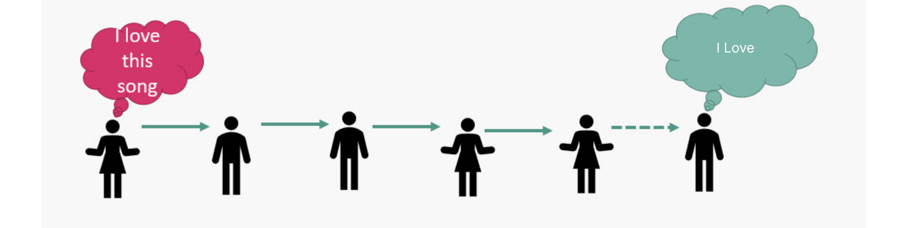
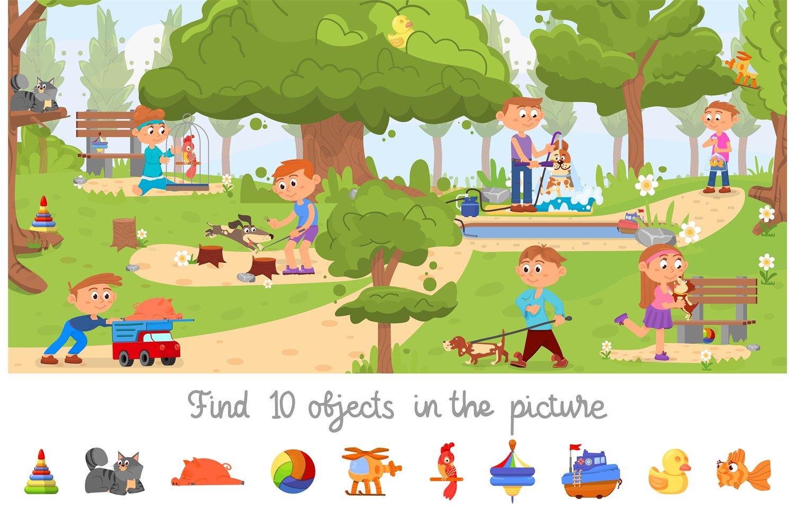
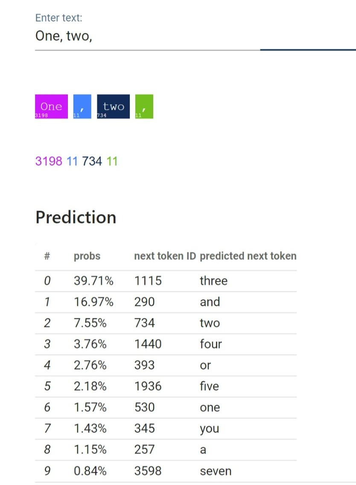

🧠 MINGGU 6: ATTENTION MECHANISM & ARSITEKTUR TRANSFORMER

Topik: "Attention Is All You Need" dan Fondasi Model Bahasa Raksasa (LLM)
Durasi: 150 Menit (2,5 Jam)

---

## 1. ERA SEBELUM TRANSFORMER: MENGAPA KITA BUTUH "PERHATIAN"?

*(Sesi ini bertujuan sebagai "Hook" atau pancingan agar mahasiswa menyadari bahwa arsitektur AI pendahulu memiliki kelemahan fatal, membangun rasa penasaran sebelum kita membongkar arsitektur Transformer).*

### A. Keterbatasan Ingatan Mesin (The Bottleneck)

Mari kita memutar waktu sejenak. Dulu, untuk membuat AI yang bisa memahami teks, para ilmuwan sangat bergantung pada arsitektur bernama **RNN (Recurrent Neural Network)** dan versi mutakhirnya, **LSTM (Long Short-Term Memory)**. 

Cara kerja RNN ini dibuat sangat mirip dengan cara manusia membaca: berurutan dari kiri ke kanan, kata per kata. AI akan membaca kata pertama, memprosesnya, menyimpan informasinya, lalu lanjut membaca kata kedua, dan seterusnya secara berurutan.

Kedengarannya sangat masuk akal dan natural, bukan? Namun, pada praktiknya metode ini ternyata memendam kelemahan yang sangat fatal: **The Bottleneck (Leher Botol)**. 

Coba bayangkan Anda disuruh membaca buku teks sejarah setebal 1000 halaman secara berurutan. Saat Anda akhirnya sampai di halaman 1000, Anda kemungkinan besar sudah lupa dengan detail nama tokoh atau tempat yang ada di halaman pertama. Inilah persisnya yang dialami oleh model RNN! Semakin panjang kalimat atau dokumen yang diproses, konteks yang berada di awal teks akan semakin memudar dan akhirnya terlupakan oleh mesin.

Secara matematis, fenomena ini disebut sebagai **Masalah Vanishing Gradient**. Di minggu lalu, Anda sudah melihat bagaimana arsitektur ResNet menyelesaikan masalah "hilangnya sinyal" ini pada pemrosesan gambar (CNN) menggunakan jalur pintas (*skip connections*). Namun, untuk data teks yang *berurutan*, informasinya harus mengantre sangat panjang. Sinyal asli dari awal kalimat perlahan "menguap" karena harus melewati ratusan kali perkalian matematis sebelum sampai di akhir. 

Akibatnya? Model menjadi sangat "pelupa" pada teks panjang. Lebih parahnya lagi, pelatihannya berjalan sangat lambat karena harus memproses teks secara sekuensial (harus menunggu kata ke-1 selesai untuk bisa memproses kata ke-2) dan tidak bisa diparalelkan di banyak GPU.

*Lalu, jika mesin yang membaca teks kata per kata selalu berujung menjadi pelupa dan lambat, adakah cara lain agar AI bisa memproses ribuan kata sekaligus tanpa melupakan konteks aslinya?*

### B. Lahirnya Konsep "Attention": Terinspirasi dari Otak Manusia

Jawaban dari kebuntuan di atas ternyata datang dari ilmu sains kognitif (*cognitive science*) dan cara kerja **otak manusia** itu sendiri. 

Di dalam otak kita, terdapat mekanisme pemrosesan informasi yang disebut *Visual/Cognitive Attention*. Otak kita tidak pernah memproses semua informasi yang masuk secara merata (karena itu akan membuat otak *overload*). Sebaliknya, otak kita secara otomatis melakukan *Selective Focus* atau fokus selektif. Inilah yang secara langsung menginspirasi para ilmuwan AI untuk menciptakan mekanisme **"Attention" (Perhatian)** pada jaringan saraf tiruan.

Contoh attention
Contoh 1:
Game Find the difference

Contoh 2:
Game Find the Object

Coba bayangkan: Saat Anda melihat sebuah foto pasar yang ramai untuk mencari teman Anda, apakah Anda menganalisis setiap piksel dari ujung kiri ke kanan secara merata? Tentu tidak! Anda langsung memberikan **fokus (attention)** pada wajah-wajah orang dan mengabaikan langit atau jalanan. Sama halnya saat menerjemahkan kalimat kompleks, kita memberikan "bobot" lebih pada kata kunci tertentu.

Dalam dunia AI, *Attention Mechanism* adalah sebuah terobosan matematis yang memungkinkan mesin meniru cara otak manusia beroperasi ini. AI tidak lagi dipaksa mengingat seluruh teks secara membabi buta ke dalam satu ruang memori sempit (seperti RNN), melainkan dibekali kemampuan untuk secara dinamis bertanya: *"Saat saya membaca kata saat ini, kata-kata mana saja di masa lalu yang paling relevan dan penting untuk saya beri perhatian lebih?"*

---

## 2. BEDAH TEORI: "ATTENTION IS ALL YOU NEED" DAN KELAHIRAN LLM

*(Ini adalah inti materi. Jangan gunakan turunan rumus matematika kompleks, fokus pada intuisi spasial dari sistem database pencarian).*

### A. Anatomi Self-Attention: Query, Key, dan Value (Q, K, V)

Bagaimana sebenarnya *Attention* bekerja secara matematis? Mari gunakan **Analogi Pencarian YouTube**.

Dalam arsitektur *Self-Attention*, setiap kata yang masuk akan dipecah menjadi tiga representasi vektor: **Query (Q), Key (K), dan Value (V)**.

*   **Query (Q) - "Apa yang sedang dicari"**: Mirip seperti teks yang Anda ketik di kolom pencarian YouTube (misal: "Tutorial AI"). Ini adalah kata yang saat ini sedang diproses oleh model.
*   **Key (K) - "Label/Kategori di Rak"**: Mirip seperti judul, tag, atau deskripsi pada video-video yang ada di YouTube. Ini adalah identitas dari kata-kata lain di dalam kalimat yang sama.
*   **Value (V) - "Isi Video"**: Ini adalah konten sebenarnya dari video tersebut, atau dalam NLP, makna intrinsik dari kata tersebut.

**Cara kerjanya:**
Sistem akan menghitung seberapa mirip **Query** Anda dengan semua **Key** yang ada menggunakan perkalian matriks (*dot product*). Jika kemiripannya tinggi (skornya besar), maka model akan mengambil **Value** dari kata tersebut dan menggabungkannya sebagai konteks. Dengan ini, kata "Bank" bisa mengenali apakah ia merujuk pada institusi keuangan (jika Key di sekitarnya adalah "uang", "bunga") atau tepi sungai (jika Key di sekitarnya adalah "air", "perahu").

### B. Arsitektur Sang Revolusioner: Transformer

Pada tahun 2017, peneliti Google merilis *paper* legendaris berjudul **"Attention Is All You Need"**. 

Penemuan terbesarnya bukanlah menciptakan *Attention*, melainkan penemuan bahwa **kita bisa membuang RNN sepenuhnya**. Mereka membuktikan bahwa kita tidak perlu membaca teks secara berurutan. Dengan menggunakan **Multi-Head Attention**, Transformer melihat **semua kata dalam satu kalimat secara serentak (paralel)**, menghitung hubungan Q, K, V untuk setiap kata dengan setiap kata lainnya di waktu yang bersamaan.

Karena sifatnya yang paralel, Transformer sangat luar biasa cepat jika dilatih di atas GPU. Leher botol kecepatan akhirnya hancur. Inilah titik mula AI melesat begitu cepat, karena sekarang kita bisa melatih model dengan data sebesar internet!

*(Arsitektur asli Transformer dari paper tahun 2017)*

### C. Dari Transformer Menuju ChatGPT, Gemini, dan Claude

Bagaimana arsitektur dari 2017 ini bisa menjadi ChatGPT yang kita kenal sekarang?

Arsitektur Transformer asli memiliki dua bagian: **Encoder** (untuk memahami teks masukan) dan **Decoder** (untuk menghasilkan teks keluaran). 

Model seperti **ChatGPT (Generative Pre-trained Transformer)** pada dasarnya "membuang" bagian Encoder dan hanya menggunakan **Decoder**. Model ini dilatih dengan satu tugas yang luar biasa sederhana: **Memprediksi Kata Selanjutnya (Next-Token Prediction)** dari milyaran halaman web di internet.

Secara ajaib, ketika model disuruh memprediksi kata selanjutnya secara terus-menerus pada data skala masif dengan arsitektur Transformer, model tersebut mulai "memahami" tata bahasa, logika, fakta dunia, hingga kemampuan pemrograman. Gabungan antara prediksi sederhana dan mekanisme *Attention* yang memahami konteks inilah yang melahirkan kecerdasan buatan sintetik masa kini.

---

## 3. KAPASITAS MODEL: PARAMETER VS TINGKAT KECERDASAN

*(Sesi penutup yang memicu pemikiran kritis. Ajak mereka berdebat tentang masa depan AI).*

### A. Apa itu Parameter dalam LLM?

Di minggu ke-5, Anda telah belajar tentang *Artificial Neural Network* (ANN) yang memiliki *weights* (bobot) dan *biases*. Dalam LLM, bobot dan bias inilah yang disebut sebagai **Parameter**. 

Anda bisa membayangkan parameter sebagai **"sinapsis" atau koneksi saraf** di dalam otak buatan model tersebut. Semakin banyak parameter, semakin banyak pola, bahasa, dan pengetahuan yang bisa "diingat" dan dihubungkan oleh AI.
*   **GPT-1 (2018):** ~117 Juta parameter (Mulai bisa menulis paragraf singkat).
*   **GPT-3 (2020):** ~175 Miliar parameter (Bisa coding, menulis essay panjang, dan lulus ujian manusia).

### B. Scaling Laws: Semakin Besar Pasti Semakin Pintar?

Di dunia AI saat ini, terdapat sebuah hukum yang diyakini perusahaan teknologi besar, yaitu **Scaling Laws**. Hukum ini secara sederhana menyatakan bahwa:
> *Kecerdasan sebuah model AI akan terus meningkat secara terprediksi seiring dengan penambahan Ukuran Model (Parameter), Jumlah Data Pelatihan, dan Daya Komputasi (GPU).*

Inilah alasan mengapa OpenAI, Google, dan Meta menghabiskan miliaran dolar untuk membangun superkomputer raksasa. Namun, ini memunculkan pertanyaan: Apakah untuk mencapai *Artificial General Intelligence (AGI)* kita hanya perlu terus menambah jumlah GPU dan ukuran parameter? Ataukah kita akan segera menabrak batas, mengingat kita mulai kehabisan teks berkualitas tinggi buatan manusia di internet untuk dijadikan data latih?

### C. Debat Kelas: Data Berkualitas vs Komputasi Raksasa

**Instruksi Debat Kelas (15 Menit):**
1. Bagi kelas menjadi kelompok kecil.
2. Lemparkan studi kasus nyata ini kepada mahasiswa:
   > *"Model Llama-3 dari Meta yang berukuran 'hanya' 8 Biliar parameter terbukti mampu mengalahkan performa model-model AI generasi sebelumnya yang berukuran raksasa, lebih dari 100 Biliar parameter. Menurut kalian, kenapa model yang otaknya lebih kecil bisa lebih cerdas?"*

**Arahkan Diskusi Ke:**
Ajak mahasiswa menyadari bahwa ukuran (komputasi) bukanlah segalanya. Kunci dari model-model modern adalah **Kualitas Data**. Konsep *Chinchilla Scaling Laws* membuktikan bahwa melatih model kecil dengan data yang sangat bersih, terstruktur, dan berkualitas tinggi jauh lebih efektif daripada menjejalkan data "sampah" ke model raksasa. Selain itu, teknik penyelarasan seperti **RLHF (Reinforcement Learning from Human Feedback)** dan instruksi *fine-tuning* memainkan peran sangat besar untuk membuat AI yang "sopan" dan berguna, bukan sekadar beo mekanik.

---

💡 **Takeaway Minggu Ini:**
Kecerdasan LLM saat ini bukanlah sihir, melainkan kemampuan matematis raksasa untuk memprediksi kata selanjutnya secara akurat, yang dimungkinkan karena model tersebut tahu kata mana yang harus diberikan "Perhatian" (*Attention*) secara paralel.
